# CampusFlow — System Architecture

> **Stage:** Architecture Design (Step 2)  
> **Version:** 2.1 — Updated 2026-08-27 (architecture review decisions applied)  

---

## Table of Contents

1. [Architectural Philosophy](#1-architectural-philosophy)
2. [High-Level System Architecture](#2-high-level-system-architecture)
3. [Backend Modular Monolith Design](#3-backend-modular-monolith-design)
4. [Frontend Architecture](#4-frontend-architecture)
5. [Placement Lifecycle & State Machine](#5-placement-lifecycle--state-machine)
6. [Dynamic Eligibility Engine](#6-dynamic-eligibility-engine)
7. [Authentication & Authorization Boundary](#7-authentication--authorization-boundary)
8. [Deployment Architecture](#8-deployment-architecture)
9. [Detailed Data Flows](#9-detailed-data-flows)
10. [Technology Selection Rationale](#10-technology-selection-rationale)

---

## 1. Architectural Philosophy

### Why a Modular Monolith (not Microservices)?

CampusFlow serves a single college, with at most a few thousand concurrent users during peak placement seasons. The added operational complexity of microservices (network latency, distributed tracing, independent deployments, inter-service auth) would far outweigh any benefit at this scale.

A **modular monolith** gives us:
- Clean domain separation enforced by code structure, not network boundaries
- Single deployment unit on Cloud Run (simple, cheap, reliable)
- No distributed transaction problems
- Easy to extract services later if scale demands it

The **one justified exception** is the notification worker — it is a separate Cloud Run service because:
1. It is invoked by Cloud Tasks (not the HTTP frontend path)
2. It has different scaling characteristics (bursty, async)
3. It needs `--ingress=internal` (not exposed to internet)
4. A failure in notification delivery must never affect the main API

### Simplicity Principles

- No Redis, no Kafka, no Kubernetes for MVP
- Cloud Tasks replaces a message broker for async work
- Cloud Scheduler replaces a standalone cron service
- Cloud SQL replaces a self-managed database
- Cloud Storage replaces a file server
- Everything else lives in the single FastAPI application

---

## 2. High-Level System Architecture

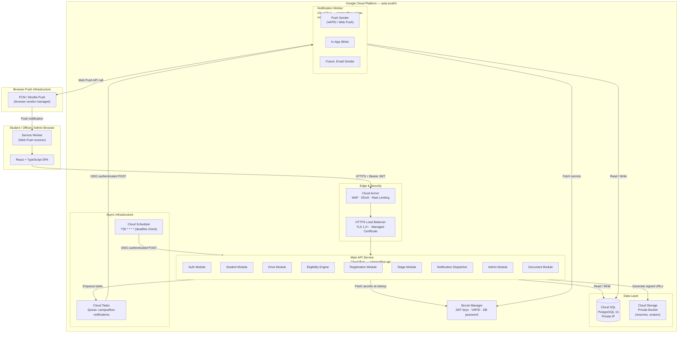
```mermaid
graph TB
    subgraph Browser["Student / Officer / Admin Browser"]
        SPA["React + TypeScript SPA"]
        SW["Service Worker\n(Web Push receiver)"]
    end

    subgraph GCP["Google Cloud Platform — asia-south1"]

        subgraph Edge["Edge & Security"]
            CA["Cloud Armor\nWAF · DDoS · Rate Limiting"]
            LB["HTTPS Load Balancer\nTLS 1.2+ · Managed Certificate"]
        end

        subgraph API["Main API Service\nCloud Run — campusflow-api"]
            direction TB
            A1["Auth Module"]
            A2["Student Module"]
            A3["Drive Module"]
            A4["Eligibility Engine"]
            A5["Registration Module"]
            A6["Stage Module"]
            A7["Notification Dispatcher"]
            A8["Admin Module"]
            A9["Document Module"]
        end

        subgraph Worker["Notification Worker\nCloud Run — campusflow-worker\ninternal-only ingress"]
            W1["Push Sender\n(VAPID / Web Push)"]
            W2["In-App Writer"]
            W3["Future: Email Sender"]
        end

        subgraph Data["Data Layer"]
            PG[("Cloud SQL\nPostgreSQL 15\nPrivate IP")]
            GCS["Cloud Storage\nPrivate Bucket\n(resumes, avatars)"]
        end

        subgraph Async["Async Infrastructure"]
            CT["Cloud Tasks\nQueue: campusflow-notifications"]
            CS["Cloud Scheduler\n*/30 * * * * (deadline check)"]
        end

        SM["Secret Manager\nJWT keys · VAPID · DB password"]
    end

    subgraph Push["Browser Push Infrastructure"]
        FCM["FCM / Mozilla Push\n(browser-vendor managed)"]
    end

    SPA -->|"HTTPS + Bearer JWT"| CA
    CA --> LB
    LB --> API

    API -->|"Read / Write"| PG
    API -->|"Generate signed URLs"| GCS
    API -->|"Enqueue tasks"| CT
    API -->|"Fetch secrets at startup"| SM

    CS -->|"OIDC-authenticated POST"| API
    CT -->|"OIDC-authenticated POST"| Worker

    Worker -->|"Read / Write"| PG
    Worker -->|"Fetch secrets"| SM
    Worker -->|"Web Push API call"| FCM
    FCM -->|"Push notification"| SW
    SW --> SPA
```

---

## 3. Backend Modular Monolith Design

### 3.1 Layer Architecture

Every domain module follows the same 4-layer pattern. The layers have strict dependency rules — upper layers can call lower layers, never the reverse.

```
┌──────────────────────────────────────────────────────────┐
│  API Layer  (FastAPI routers)                            │
│  • HTTP request parsing                                  │
│  • Pydantic request validation                           │
│  • Authentication dependency injection                   │
│  • Role/permission check                                 │
│  • Delegates to Service Layer                            │
│  • Formats Pydantic response                             │
├──────────────────────────────────────────────────────────┤
│  Service Layer  (domain business logic)                  │
│  • All business rules live here                          │
│  • Orchestrates Repository + other Services              │
│  • Calls Eligibility Engine                              │
│  • Dispatches notification events                        │
│  • Writes audit log entries                              │
│  • NO HTTP concepts (no Request, no Response)            │
├──────────────────────────────────────────────────────────┤
│  Repository Layer  (data access)                         │
│  • SQLAlchemy async queries                              │
│  • No business logic                                     │
│  • Returns domain model objects                          │
│  • One repository class per aggregate root               │
├──────────────────────────────────────────────────────────┤
│  Model Layer  (SQLAlchemy ORM + Pydantic schemas)        │
│  • ORM models map to DB tables                           │
│  • Pydantic schemas for API request/response             │
│  • Domain enums (DriveStatus, NotificationType, etc.)    │
└──────────────────────────────────────────────────────────┘
```

### 3.2 Domain Module Map

```
backend/
├── app/
│   ├── main.py                    ← FastAPI app factory, router registration
│   ├── core/
│   │   ├── config.py              ← Settings (read from Secret Manager / env)
│   │   ├── database.py            ← Async SQLAlchemy engine, session factory
│   │   ├── security.py            ← JWT encode/decode, JWKS cache, bcrypt, OIDC verification
│   │   ├── dependencies.py        ← FastAPI dependency: get_current_user, require_role
│   │   ├── exceptions.py          ← Custom exception classes + handlers
│   │   ├── gcs.py                 ← Cloud Storage client, signed URL helpers
│   │   └── email.py               ← EmailService interface + SendGridAdapter
│   │                                (provider abstracted — swap adapter to change provider)
│   │
│   ├── domains/
│   │   ├── auth/
│   │   │   ├── router.py          ← POST /auth/login, /refresh, /logout, /activate
│   │   │   ├── service.py         ← Login, token issuance, revocation, activation, resend-activation
│   │   │   ├── repository.py      ← refresh_tokens, account_activations table access
│   │   │   └── schemas.py         ← LoginRequest, TokenResponse, ActivateRequest
│   │   │
│   │   ├── users/
│   │   │   ├── router.py          ← GET/PATCH /students/me, /officers/students
│   │   │   ├── service.py         ← Profile update, CGPA history write
│   │   │   ├── repository.py      ← users, student_profiles queries
│   │   │   └── schemas.py
│   │   │
│   │   ├── companies/
│   │   │   ├── router.py
│   │   │   ├── service.py
│   │   │   ├── repository.py
│   │   │   └── schemas.py
│   │   │
│   │   ├── drives/
│   │   │   ├── router.py          ← Drive CRUD + status transitions
│   │   │   ├── service.py         ← Lifecycle state machine enforcement
│   │   │   ├── repository.py
│   │   │   └── schemas.py
│   │   │
│   │   ├── eligibility/
│   │   │   ├── engine.py          ← EligibilityEngine (pure function, no DB)
│   │   │   ├── evaluators.py      ← CgpaEvaluator, BacklogEvaluator, etc.
│   │   │   ├── schemas.py         ← EligibilityCriteria, EligibilityResult
│   │   │   └── router.py          ← GET /drives/{id}/eligibility-check
│   │   │
│   │   ├── registrations/
│   │   │   ├── router.py
│   │   │   ├── service.py         ← Registration gate, reminder cancellation
│   │   │   ├── repository.py
│   │   │   └── schemas.py
│   │   │
│   │   ├── stages/
│   │   │   ├── router.py
│   │   │   ├── service.py         ← Shortlisting, result publishing
│   │   │   ├── repository.py
│   │   │   └── schemas.py
│   │   │
│   │   ├── notifications/
│   │   │   ├── router.py          ← GET /notifications, push subscription mgmt
│   │   │   ├── dispatcher.py      ← Enqueues Cloud Tasks (never sends directly)
│   │   │   ├── repository.py
│   │   │   └── schemas.py
│   │   │
│   │   ├── documents/
│   │   │   ├── router.py          ← Signed URL generation, upload confirmation
│   │   │   ├── service.py         ← GCS path management, size/type validation
│   │   │   └── schemas.py
│   │   │
│   │   └── admin/
│   │       ├── router.py          ← User management, audit logs, config, bulk-import, resend-activation
│   │       ├── service.py         ← Calls EmailService.send_activation(); rate-limits resend
│   │       ├── repository.py
│   │       └── schemas.py
│   │
│   ├── branches/                  ← Controlled branch vocabulary (Decision C)
│   │   ├── router.py              ← GET /branches, POST/PATCH /branches (admin/officer)
│   │   ├── service.py
│   │   ├── repository.py
│   │   └── schemas.py             ← BranchCode (used by eligibility engine + student profiles)
│   │
│   ├── internal/                  ← Cloud Tasks + Scheduler handlers (not public)
│   │   ├── router.py              ← POST /internal/tasks/notify, /scheduler/deadlines
│   │   └── deadline_checker.py
│   │
│   └── models/                    ← All SQLAlchemy ORM models
│       ├── user.py
│       ├── account_activation.py
│       ├── student_profile.py
│       ├── branch.py
│       ├── company.py
│       ├── drive.py
│       ├── registration.py
│       ├── stage.py
│       ├── notification.py
│       └── audit_log.py
│
├── worker/                        ← Separate Cloud Run service
│   ├── main.py
│   ├── handlers/
│   │   ├── push_sender.py
│   │   └── inapp_writer.py
│   └── Dockerfile
│
├── alembic/                       ← Database migration scripts
├── tests/
│   ├── unit/
│   └── integration/
└── Dockerfile
```

### 3.3 Cross-Cutting Concerns

| Concern | Mechanism |
|---|---|
| Request authentication | FastAPI `Depends(get_current_user)` on every protected router |
| Role enforcement | FastAPI `Depends(require_role([Role.OFFICER]))` per endpoint |
| Input validation | Pydantic v2 strict mode on all request bodies |
| Audit logging | Service layer calls `AuditLogRepository.log()` before returning |
| Error handling | Global exception handler → RFC 7807 Problem Details JSON |
| DB session | `AsyncSession` injected per-request via `Depends(get_db)` |
| Secrets | Loaded once at startup from Secret Manager, cached in `Settings` object |

---

## 4. Frontend Architecture

### 4.1 Technology

| Concern | Choice | Reason |
|---|---|---|
| Framework | React 18 + TypeScript | Type safety, large ecosystem |
| Build tool | Vite | Fast HMR, optimized production builds |
| Routing | React Router v6 | Standard SPA routing with nested routes |
| Server state | TanStack Query (React Query) | Cache, background refetch, optimistic updates |
| Client state | Zustand | Lightweight global state (auth user, notifications) |
| HTTP client | Axios | Interceptors for token refresh and error normalization |
| Forms | React Hook Form + Zod | Performant forms with schema validation |
| Push | Service Worker + Web Push API | Browser push notifications |

### 4.2 Route Structure

```
/                           → Redirect to /dashboard or /login
/login                      → Public — LoginPage

/dashboard                  → Protected (STUDENT) — Student home
/drives                     → Protected (STUDENT) — All published drives
/drives/:driveId            → Protected (STUDENT) — Drive detail + eligibility
/applications               → Protected (STUDENT) — My registrations
/applications/:driveId      → Protected (STUDENT) — Single application detail + stage timeline
/notifications              → Protected (ALL) — Notification center
/profile                    → Protected (STUDENT) — Edit profile + resume upload

/officer                    → Protected (OFFICER | ADMIN) — Layout wrapper
/officer/dashboard          → Officer home / summary
/officer/companies          → Company list
/officer/companies/new      → Create company
/officer/companies/:id      → Edit company
/officer/drives             → All drives
/officer/drives/new         → Create drive
/officer/drives/:id         → Drive detail (manage lifecycle)
/officer/drives/:id/criteria → Edit eligibility criteria
/officer/drives/:id/registrations → View registered students
/officer/drives/:id/stages  → Manage stages
/officer/drives/:id/stages/:stageId → Shortlist + results for a stage
/officer/analytics          → Placement analytics dashboard

/admin                      → Protected (ADMIN) — Layout wrapper
/admin/users                → User management
/admin/users/:id            → User detail / edit role
/admin/audit-logs           → Audit log viewer
/admin/config               → System configuration

* (catch-all)               → 404 NotFoundPage
```

### 4.3 Protected Route Strategy

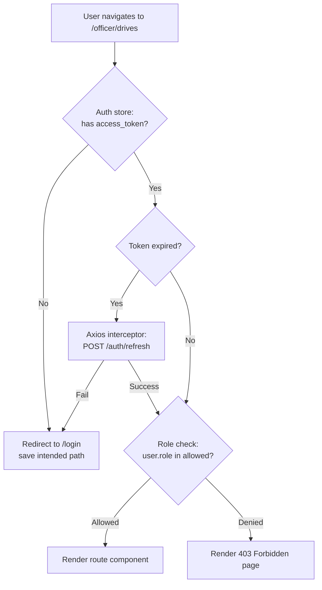
```mermaid
flowchart TD
    A["User navigates to /officer/drives"] --> B{Auth store:\nhas access_token?}
    B -->|No| C["Redirect to /login\nsave intended path"]
    B -->|Yes| D{Token expired?}
    D -->|Yes| E["Axios interceptor:\nPOST /auth/refresh"]
    E -->|Success| F{Role check:\nuser.role in allowed?}
    E -->|Fail| C
    D -->|No| F
    F -->|Allowed| G["Render route component"]
    F -->|Denied| H["Render 403 Forbidden page"]
```

**Implementation approach:**
- A `<ProtectedRoute roles={['OFFICER','ADMIN']}>` wrapper component handles auth + role checks
- The user object (with role) lives in Zustand store, populated at login and on page refresh via `/auth/me`
- Axios request interceptor automatically refreshes expired access tokens before retrying the original request

### 4.4 Role-Based UI Rendering

The same component tree conditionally renders based on role:

```
NavBar
├── Logo
├── [STUDENT] → Dashboard, Drives, My Applications
├── [OFFICER | ADMIN] → Officer Dashboard, Drives, Analytics
├── [ADMIN] → Admin Panel link
└── All → Notifications bell, Profile avatar, Logout
```

- Role is never trusted from localStorage — it comes from the decoded JWT (`user.role`)
- UI hiding is cosmetic only; every operation is re-authorized by the backend API

### 4.5 State Management Strategy

| State Type | Where | Why |
|---|---|---|
| Auth (user, tokens) | Zustand | Persistent across components, survives re-renders |
| Server data (drives, profiles) | TanStack Query | Cache + background refetch + invalidation |
| Form state | React Hook Form | Isolated per form, no global pollution |
| UI state (modals, toasts) | Local useState | No reason to globalize |
| Notification count | Zustand | Updated by polling + push; drives badge everywhere |

### 4.6 API Communication Pattern

All API calls go through a centralized `apiClient` (Axios instance):

```
apiClient (Axios)
├── baseURL: /api/v1
├── Request interceptor: attach Bearer token from Zustand
├── Response interceptor:
│   ├── 401 → attempt token refresh → retry original request
│   ├── 403 → show forbidden toast → do not redirect
│   ├── 429 → show rate limit toast
│   └── 5xx → show generic error toast
└── All responses typed via TypeScript interfaces generated from OpenAPI schema
```

### 4.7 Loading, Error, and Empty States

Every data-fetching component must handle all four states:

| State | Pattern |
|---|---|
| **Loading** | Skeleton placeholders (not spinners) — match the layout of the content |
| **Error** | Inline error card with retry button + error message from API |
| **Empty** | Illustrated empty state with contextual CTA (e.g., "No drives yet — check back soon") |
| **Success** | Render content |

TanStack Query's `isLoading`, `isError`, `data` pattern makes this natural:

```
if (isLoading) return <DriveListSkeleton />
if (isError) return <ErrorCard message={error.message} onRetry={refetch} />
if (!data?.length) return <EmptyState message="No placement drives yet" />
return <DriveList drives={data} />
```

---

## 5. Placement Lifecycle & State Machine

### 5.1 State Transition Diagram

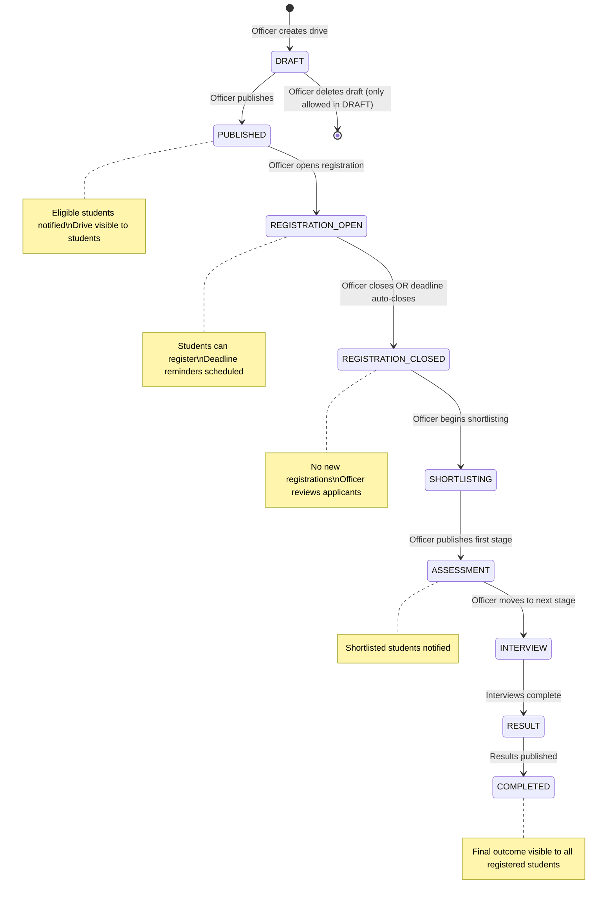
```mermaid
stateDiagram-v2
    [*] --> DRAFT : Officer creates drive

    DRAFT --> PUBLISHED : Officer publishes
    note right of PUBLISHED : Eligible students notified\nDrive visible to students

    PUBLISHED --> REGISTRATION_OPEN : Officer opens registration
    note right of REGISTRATION_OPEN : Students can register\nDeadline reminders scheduled

    REGISTRATION_OPEN --> REGISTRATION_CLOSED : Officer closes OR deadline auto-closes
    note right of REGISTRATION_CLOSED : No new registrations\nOfficer reviews applicants

    REGISTRATION_CLOSED --> SHORTLISTING : Officer begins shortlisting

    SHORTLISTING --> ASSESSMENT : Officer publishes first stage
    note right of ASSESSMENT : Shortlisted students notified

    ASSESSMENT --> INTERVIEW : Officer moves to next stage

    INTERVIEW --> RESULT : Interviews complete

    RESULT --> COMPLETED : Results published
    note right of COMPLETED : Final outcome visible to all registered students

    DRAFT --> [*] : Officer deletes draft (only allowed in DRAFT)
```

### 5.2 Transition Authorization Matrix

| Transition | Authorized Role | Side Effects |
|---|---|---|
| → `PUBLISHED` | OFFICER, ADMIN | Async: notify all eligible students |
| → `REGISTRATION_OPEN` | OFFICER, ADMIN | Async: schedule deadline reminders |
| → `REGISTRATION_CLOSED` | OFFICER, ADMIN | Async: cancel pending reminder tasks |
| → `SHORTLISTING` | OFFICER, ADMIN | No automatic notification |
| → `ASSESSMENT` | OFFICER, ADMIN | Only allowed after ≥1 stage created |
| → `INTERVIEW` | OFFICER, ADMIN | — |
| → `RESULT` | OFFICER, ADMIN | — |
| → `COMPLETED` | OFFICER, ADMIN | Async: notify registered students of final result |

### 5.3 Transition Validation Rules

- Transitions must be sequential — skipping a state is not allowed
- `ASSESSMENT` requires at least one placement stage to exist
- `REGISTRATION_CLOSED` can be triggered automatically when `NOW() > registration_deadline` via the scheduler
- Once `COMPLETED`, no further transitions are possible
- Delete is only allowed in `DRAFT` state

---

## 6. Dynamic Eligibility Engine

### 6.1 Design Principle

The eligibility engine is a **pure, stateless function**:

```
evaluate(student_profile: StudentProfile, criteria: EligibilityCriteria) → EligibilityResult
```

- No database access inside the engine
- No HTTP calls
- No AI decisions
- Fully deterministic — same inputs always produce same output
- All criteria loaded from DB before calling the engine

### 6.2 Evaluation Flow

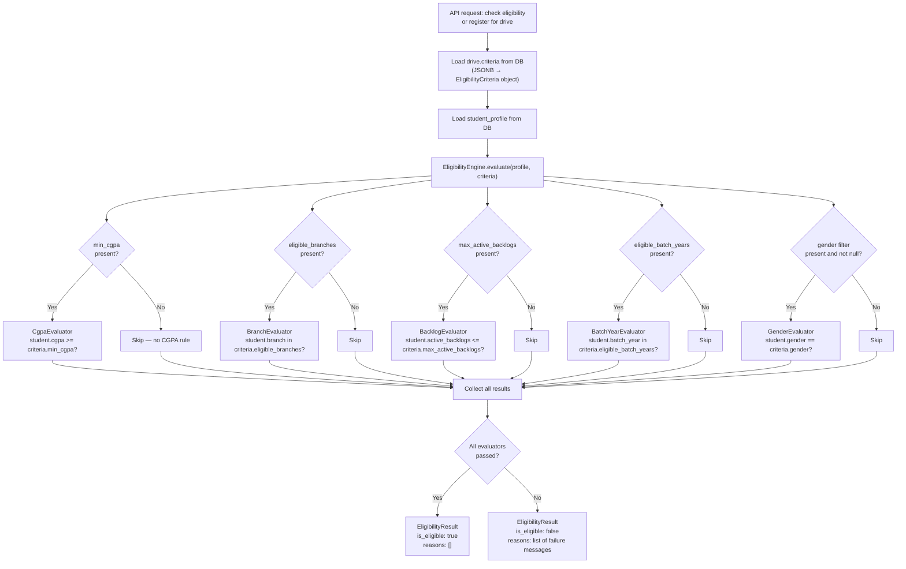
```mermaid
flowchart TD
    A["API request: check eligibility\nor register for drive"] --> B["Load drive.criteria from DB\n(JSONB → EligibilityCriteria object)"]
    B --> C["Load student_profile from DB"]
    C --> D["EligibilityEngine.evaluate(profile, criteria)"]

    D --> E1{"min_cgpa\npresent?"}
    E1 -->|Yes| F1["CgpaEvaluator\nstudent.cgpa >= criteria.min_cgpa?"]
    E1 -->|No| G1["Skip — no CGPA rule"]

    D --> E2{"eligible_branches\npresent?"}
    E2 -->|Yes| F2["BranchEvaluator\nstudent.branch in criteria.eligible_branches?"]
    E2 -->|No| G2["Skip"]

    D --> E3{"max_active_backlogs\npresent?"}
    E3 -->|Yes| F3["BacklogEvaluator\nstudent.active_backlogs <= criteria.max_active_backlogs?"]
    E3 -->|No| G3["Skip"]

    D --> E4{"eligible_batch_years\npresent?"}
    E4 -->|Yes| F4["BatchYearEvaluator\nstudent.batch_year in criteria.eligible_batch_years?"]
    E4 -->|No| G4["Skip"]

    D --> E5{"gender filter\npresent and not null?"}
    E5 -->|Yes| F5["GenderEvaluator\nstudent.gender == criteria.gender?"]
    E5 -->|No| G5["Skip"]

    F1 --> R["Collect all results"]
    F2 --> R
    F3 --> R
    F4 --> R
    F5 --> R
    G1 --> R
    G2 --> R
    G3 --> R
    G4 --> R
    G5 --> R

    R --> Z{"All evaluators\npassed?"}
    Z -->|Yes| OUT1["EligibilityResult\nis_eligible: true\nreasons: []"]
    Z -->|No| OUT2["EligibilityResult\nis_eligible: false\nreasons: list of failure messages"]
```

### 6.3 Criteria Schema (JSONB stored in DB)

```json
{
  "min_cgpa": 7.0,
  "max_active_backlogs": 0,
  "eligible_branches": ["CSE", "AI", "IT"],
  "eligible_batch_years": [2025, 2026],
  "gender": null,

  // Future extensions — engine skips unknown fields gracefully:
  "min_attendance_pct": null,
  "placement_type": null,
  "tenth_min_percentage": null
}
```

### 6.4 Evaluator Result Format

Each evaluator returns a typed result:

```python
@dataclass
class EvaluatorResult:
    field: str           # e.g., "min_cgpa"
    passed: bool
    reason: str | None   # e.g., "CGPA 6.8 is below required 7.0" (only when failed)
```

Final result:

```python
@dataclass
class EligibilityResult:
    is_eligible: bool
    reasons: list[str]   # Empty if eligible; one entry per failing criterion
```

### 6.5 Adding New Criteria Types (Zero-Downtime Extension)

To add a new criterion (e.g., `min_attendance_pct`):
1. Write `AttendanceEvaluator` class
2. Register it in `EligibilityEngine.EVALUATORS`
3. New drives can include `min_attendance_pct` in their criteria JSON
4. Existing drives without that field are unaffected — evaluator is skipped when field is absent
5. **No database migration needed for existing drives**

---

## 7. Authentication & Authorization Boundary

### 7.1 Full Auth Flow

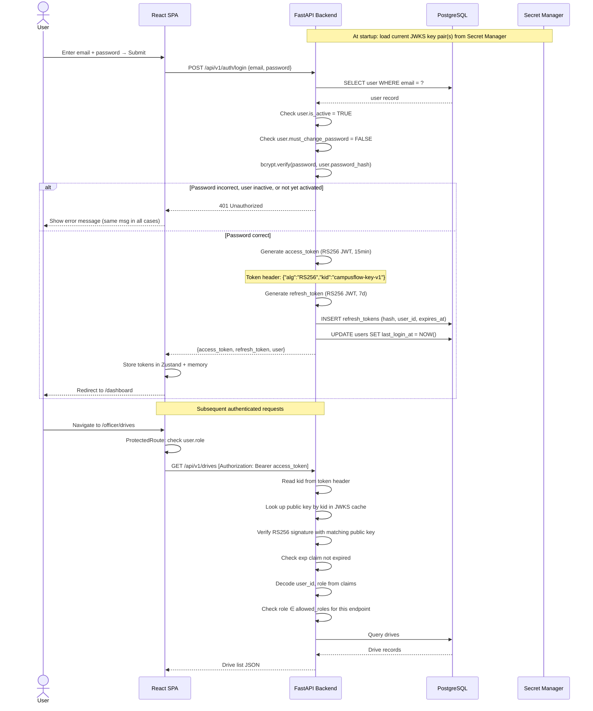
```mermaid
sequenceDiagram
    actor User
    participant FE as React SPA
    participant BE as FastAPI Backend
    participant DB as PostgreSQL
    participant SM as Secret Manager

    Note over BE,SM: At startup: load current JWKS key pair(s) from Secret Manager

    User->>FE: Enter email + password → Submit
    FE->>BE: POST /api/v1/auth/login {email, password}
    BE->>DB: SELECT user WHERE email = ?
    DB-->>BE: user record
    BE->>BE: Check user.is_active = TRUE
    BE->>BE: Check user.must_change_password = FALSE
    BE->>BE: bcrypt.verify(password, user.password_hash)

    alt Password incorrect, user inactive, or not yet activated
        BE-->>FE: 401 Unauthorized
        FE-->>User: Show error message (same msg in all cases)
    else Password correct
        BE->>BE: Generate access_token (RS256 JWT, 15min)
        note over BE: Token header: {"alg":"RS256","kid":"campusflow-key-v1"}
        BE->>BE: Generate refresh_token (RS256 JWT, 7d)
        BE->>DB: INSERT refresh_tokens (hash, user_id, expires_at)
        BE->>DB: UPDATE users SET last_login_at = NOW()
        BE-->>FE: {access_token, refresh_token, user}
        FE->>FE: Store tokens in Zustand + memory
        FE-->>User: Redirect to /dashboard
    end

    Note over FE,BE: Subsequent authenticated requests

    User->>FE: Navigate to /officer/drives
    FE->>FE: ProtectedRoute: check user.role
    FE->>BE: GET /api/v1/drives [Authorization: Bearer access_token]
    BE->>BE: Read kid from token header
    BE->>BE: Look up public key by kid in JWKS cache
    BE->>BE: Verify RS256 signature with matching public key
    BE->>BE: Check exp claim not expired
    BE->>BE: Decode user_id, role from claims
    BE->>BE: Check role ∈ allowed_roles for this endpoint
    BE->>DB: Query drives
    DB-->>BE: Drive records
    BE-->>FE: Drive list JSON
```

**Account Activation Flow (new student, Decision 2):**

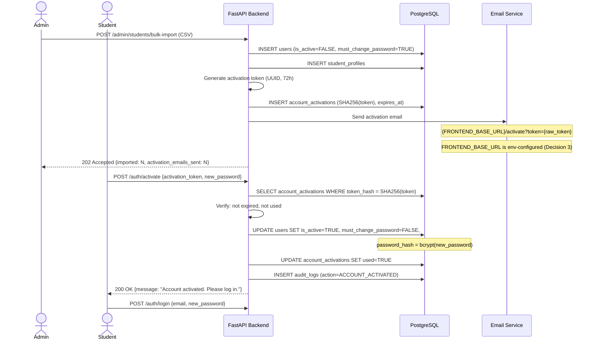
```mermaid
sequenceDiagram
    actor Admin
    actor Student
    participant BE as FastAPI Backend
    participant DB as PostgreSQL
    participant EMAIL as Email Service

    Admin->>BE: POST /admin/students/bulk-import (CSV)
    BE->>DB: INSERT users (is_active=FALSE, must_change_password=TRUE)
    BE->>DB: INSERT student_profiles
    BE->>BE: Generate activation token (UUID, 72h)
    BE->>DB: INSERT account_activations (SHA256(token), expires_at)
    BE->>EMAIL: Send activation email
    note over EMAIL: {FRONTEND_BASE_URL}/activate?token={raw_token}
    note over EMAIL: FRONTEND_BASE_URL is env-configured (Decision 3)
    BE-->>Admin: 202 Accepted {imported: N, activation_emails_sent: N}

    Student->>BE: POST /auth/activate {activation_token, new_password}
    BE->>DB: SELECT account_activations WHERE token_hash = SHA256(token)
    BE->>BE: Verify: not expired, not used
    BE->>DB: UPDATE users SET is_active=TRUE, must_change_password=FALSE,
    note over DB: password_hash = bcrypt(new_password)
    BE->>DB: UPDATE account_activations SET used=TRUE
    BE->>DB: INSERT audit_logs (action=ACCOUNT_ACTIVATED)
    BE-->>Student: 200 OK {message: "Account activated. Please log in."}
    Student->>BE: POST /auth/login {email, new_password}
```

### 7.2 Token Refresh Flow

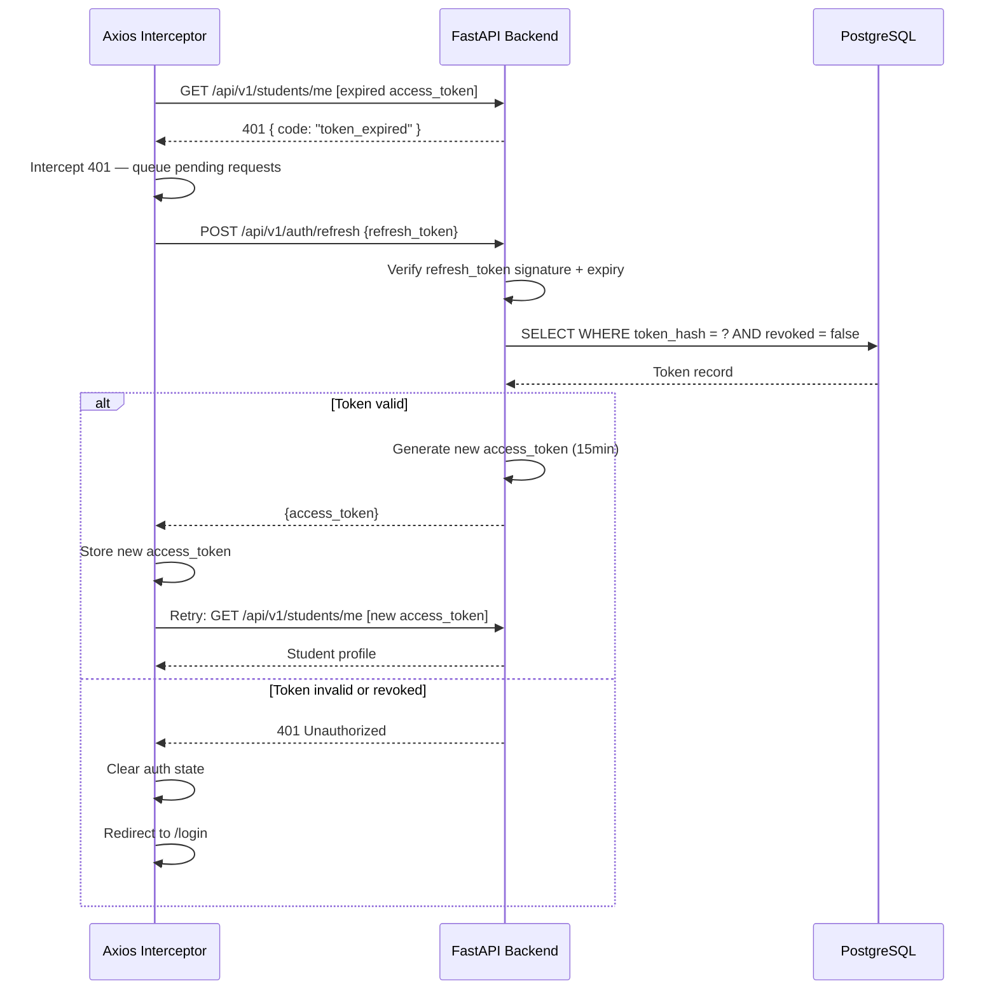
```mermaid
sequenceDiagram
    participant FE as Axios Interceptor
    participant BE as FastAPI Backend
    participant DB as PostgreSQL

    FE->>BE: GET /api/v1/students/me [expired access_token]
    BE-->>FE: 401 { code: "token_expired" }
    FE->>FE: Intercept 401 — queue pending requests
    FE->>BE: POST /api/v1/auth/refresh {refresh_token}
    BE->>BE: Verify refresh_token signature + expiry
    BE->>DB: SELECT WHERE token_hash = ? AND revoked = false
    DB-->>BE: Token record

    alt Token valid
        BE->>BE: Generate new access_token (15min)
        BE-->>FE: {access_token}
        FE->>FE: Store new access_token
        FE->>BE: Retry: GET /api/v1/students/me [new access_token]
        BE-->>FE: Student profile
    else Token invalid or revoked
        BE-->>FE: 401 Unauthorized
        FE->>FE: Clear auth state
        FE->>FE: Redirect to /login
    end
```

### 7.3 Authorization Enforcement (IDOR Prevention)

Resource ownership is enforced in the **Service Layer** — not in the router and not from the request body:

```
IDOR Attack: Student A sends GET /api/v1/students/{student_B_id}/resume-url

Backend defense:
1. JWT decoded → current_user.id = student_A_id
2. Resource lookup: target_student_id = student_B_id (from URL path)
3. Role check: current_user.role == STUDENT
4. Ownership check: current_user.id != target_student_id → 403 Forbidden
```

Officers who legitimately need student data pass the role check but not the ownership check — instead, the service layer verifies `role == OFFICER` before allowing cross-student access.

---

## 8. Deployment Architecture

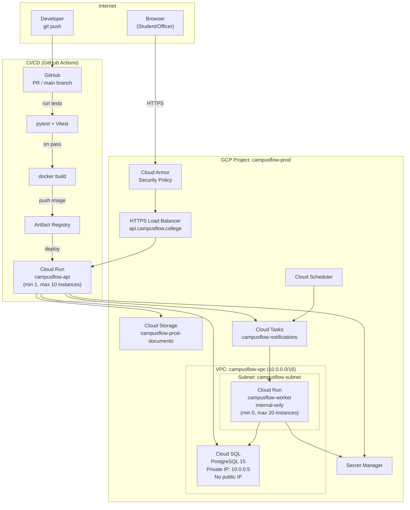
```mermaid
graph TB
    subgraph Internet
        Dev["Developer\ngit push"]
        User["Browser\n(Student/Officer)"]
    end

    subgraph CICD["CI/CD (GitHub Actions)"]
        GH["GitHub\nPR / main branch"]
        GH -->|"run tests"| TEST["pytest + Vitest"]
        TEST -->|"on pass"| BUILD["docker build"]
        BUILD -->|"push image"| AR["Artifact Registry"]
        AR -->|"deploy"| CR
    end

    subgraph GCP_PROD["GCP Project: campusflow-prod"]
        subgraph VPC["VPC: campusflow-vpc (10.0.0.0/16)"]
            subgraph Subnet["Subnet: campusflow-subnet"]
                CR["Cloud Run\ncampusflow-api\n(min 1, max 10 instances)"]
                WR["Cloud Run\ncampusflow-worker\ninternal-only\n(min 0, max 20 instances)"]
            end
            CSQL["Cloud SQL\nPostgreSQL 15\nPrivate IP: 10.0.0.5\nNo public IP"]
        end

        LB2["HTTPS Load Balancer\napi.campusflow.college"]
        CA2["Cloud Armor\nSecurity Policy"]
        GCS2["Cloud Storage\ncampusflow-prod-documents"]
        CT2["Cloud Tasks\ncampusflow-notifications"]
        CS2["Cloud Scheduler"]
        SM2["Secret Manager"]
        AR["Artifact Registry"]
    end

    User -->|"HTTPS"| CA2 --> LB2 --> CR
    CR --> CSQL
    CR --> GCS2
    CR --> CT2
    CR --> SM2
    CT2 --> WR
    CS2 --> CT2
    WR --> CSQL
    WR --> SM2
    Dev --> GH
```

**Service Accounts and Least-Privilege Roles:**

| Service Account | Bound To | IAM Roles |
|---|---|---|
| `campusflow-api-sa` | campusflow-api Cloud Run | `cloudsql.client`, `storage.objectAdmin`, `cloudtasks.enqueuer`, `secretmanager.secretAccessor`, `cloudscheduler.jobRunner` |
| `campusflow-worker-sa` | campusflow-worker Cloud Run | `cloudsql.client`, `secretmanager.secretAccessor` |
| `campusflow-scheduler-sa` | Cloud Scheduler | `cloudtasks.enqueuer` |
| `campusflow-tasks-sa` | Cloud Tasks (OIDC token) | `run.invoker` on campusflow-worker only |

---

## 9. Detailed Data Flows

### Flow 1: Student Login

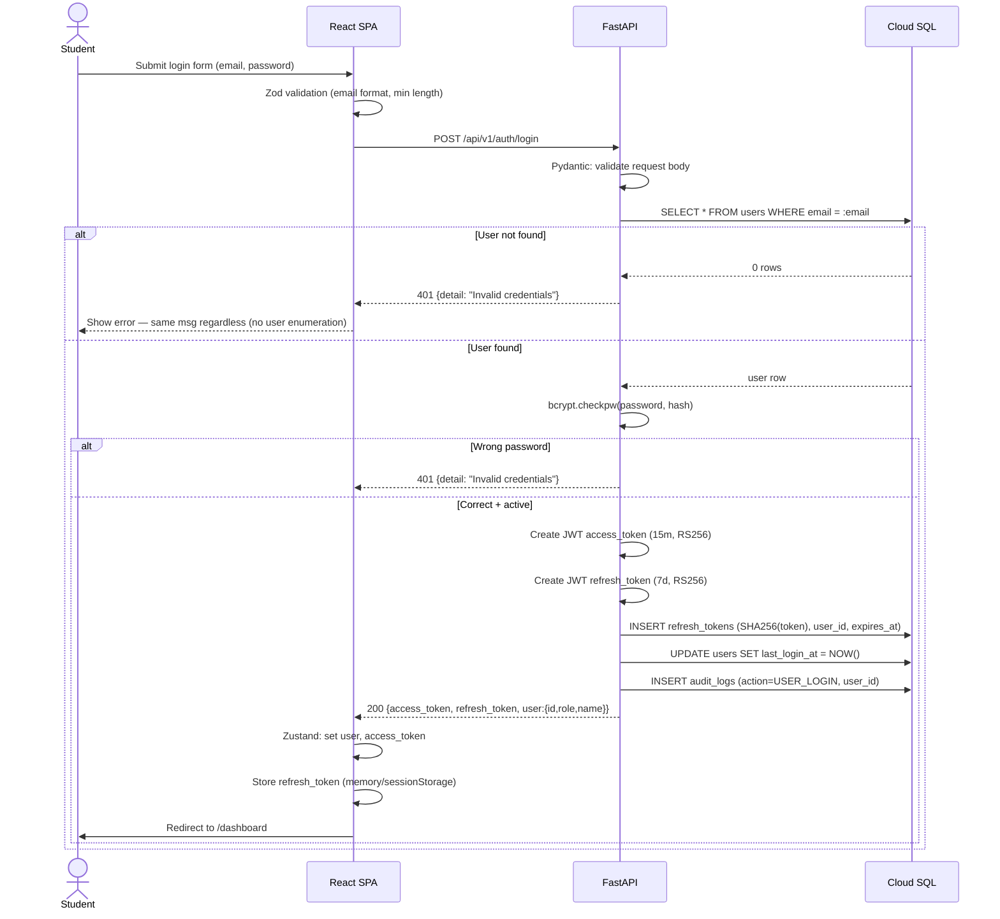
```mermaid
sequenceDiagram
    actor S as Student
    participant FE as React SPA
    participant BE as FastAPI
    participant DB as Cloud SQL

    S->>FE: Submit login form (email, password)
    FE->>FE: Zod validation (email format, min length)
    FE->>BE: POST /api/v1/auth/login
    BE->>BE: Pydantic: validate request body
    BE->>DB: SELECT * FROM users WHERE email = :email
    alt User not found
        DB-->>BE: 0 rows
        BE-->>FE: 401 {detail: "Invalid credentials"}
        FE-->>S: Show error — same msg regardless (no user enumeration)
    else User found
        DB-->>BE: user row
        BE->>BE: bcrypt.checkpw(password, hash)
        alt Wrong password
            BE-->>FE: 401 {detail: "Invalid credentials"}
        else Correct + active
            BE->>BE: Create JWT access_token (15m, RS256)
            BE->>BE: Create JWT refresh_token (7d, RS256)
            BE->>DB: INSERT refresh_tokens (SHA256(token), user_id, expires_at)
            BE->>DB: UPDATE users SET last_login_at = NOW()
            BE->>DB: INSERT audit_logs (action=USER_LOGIN, user_id)
            BE-->>FE: 200 {access_token, refresh_token, user:{id,role,name}}
            FE->>FE: Zustand: set user, access_token
            FE->>FE: Store refresh_token (memory/sessionStorage)
            FE->>S: Redirect to /dashboard
        end
    end
```

---

### Flow 2: Student Profile Retrieval

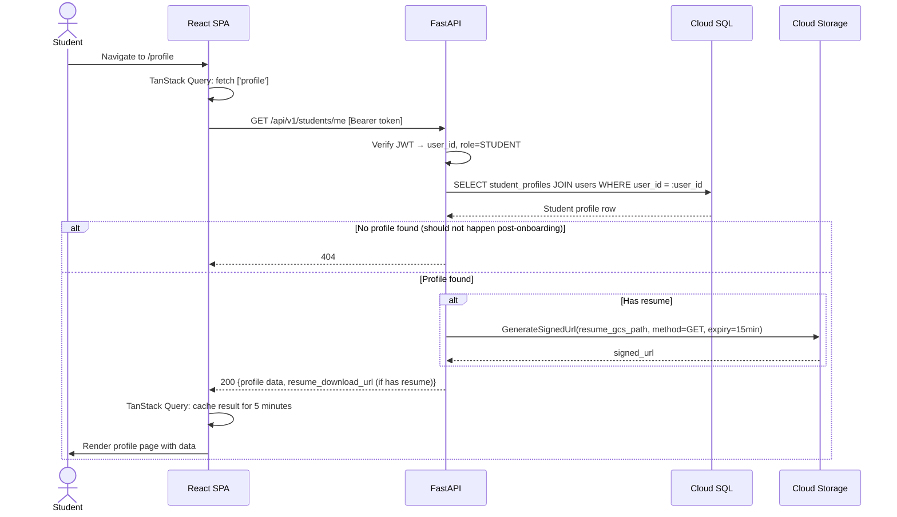
```mermaid
sequenceDiagram
    actor S as Student
    participant FE as React SPA
    participant BE as FastAPI
    participant DB as Cloud SQL
    participant GCS as Cloud Storage

    S->>FE: Navigate to /profile
    FE->>FE: TanStack Query: fetch ['profile']
    FE->>BE: GET /api/v1/students/me [Bearer token]
    BE->>BE: Verify JWT → user_id, role=STUDENT
    BE->>DB: SELECT student_profiles JOIN users WHERE user_id = :user_id
    DB-->>BE: Student profile row
    alt No profile found (should not happen post-onboarding)
        BE-->>FE: 404
    else Profile found
        alt Has resume
            BE->>GCS: GenerateSignedUrl(resume_gcs_path, method=GET, expiry=15min)
            GCS-->>BE: signed_url
        end
        BE-->>FE: 200 {profile data, resume_download_url (if has resume)}
        FE->>FE: TanStack Query: cache result for 5 minutes
        FE->>S: Render profile page with data
    end
```

---

### Flow 3: Placement Drive Creation

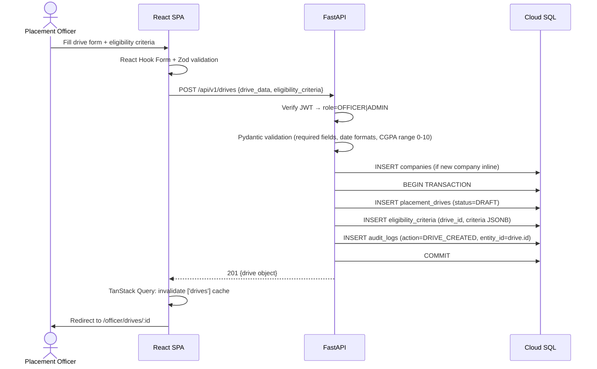
```mermaid
sequenceDiagram
    actor O as Placement Officer
    participant FE as React SPA
    participant BE as FastAPI
    participant DB as Cloud SQL

    O->>FE: Fill drive form + eligibility criteria
    FE->>FE: React Hook Form + Zod validation
    FE->>BE: POST /api/v1/drives {drive_data, eligibility_criteria}
    BE->>BE: Verify JWT → role=OFFICER|ADMIN
    BE->>BE: Pydantic validation (required fields, date formats, CGPA range 0-10)
    BE->>DB: INSERT companies (if new company inline)
    BE->>DB: BEGIN TRANSACTION
    BE->>DB: INSERT placement_drives (status=DRAFT)
    BE->>DB: INSERT eligibility_criteria (drive_id, criteria JSONB)
    BE->>DB: INSERT audit_logs (action=DRIVE_CREATED, entity_id=drive.id)
    BE->>DB: COMMIT
    BE-->>FE: 201 {drive object}
    FE->>FE: TanStack Query: invalidate ['drives'] cache
    FE->>O: Redirect to /officer/drives/:id
```

---

### Flow 4: Eligibility Evaluation

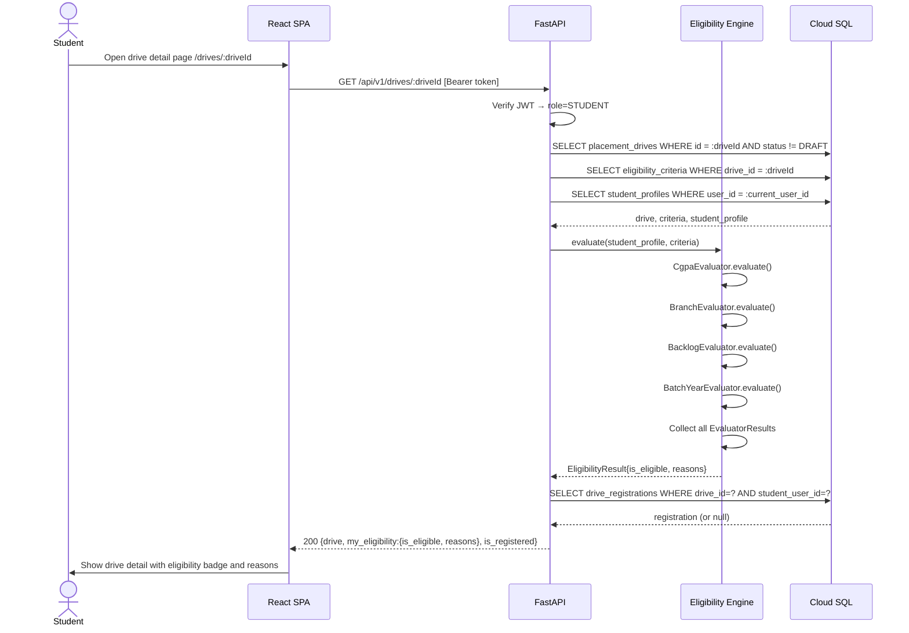
```mermaid
sequenceDiagram
    actor S as Student
    participant FE as React SPA
    participant BE as FastAPI
    participant EE as Eligibility Engine
    participant DB as Cloud SQL

    S->>FE: Open drive detail page /drives/:driveId
    FE->>BE: GET /api/v1/drives/:driveId [Bearer token]
    BE->>BE: Verify JWT → role=STUDENT
    BE->>DB: SELECT placement_drives WHERE id = :driveId AND status != DRAFT
    BE->>DB: SELECT eligibility_criteria WHERE drive_id = :driveId
    BE->>DB: SELECT student_profiles WHERE user_id = :current_user_id
    DB-->>BE: drive, criteria, student_profile

    BE->>EE: evaluate(student_profile, criteria)
    EE->>EE: CgpaEvaluator.evaluate()
    EE->>EE: BranchEvaluator.evaluate()
    EE->>EE: BacklogEvaluator.evaluate()
    EE->>EE: BatchYearEvaluator.evaluate()
    EE->>EE: Collect all EvaluatorResults
    EE-->>BE: EligibilityResult{is_eligible, reasons}

    BE->>DB: SELECT drive_registrations WHERE drive_id=? AND student_user_id=?
    DB-->>BE: registration (or null)

    BE-->>FE: 200 {drive, my_eligibility:{is_eligible, reasons}, is_registered}
    FE->>S: Show drive detail with eligibility badge and reasons
```

---

### Flow 5: Student Registration

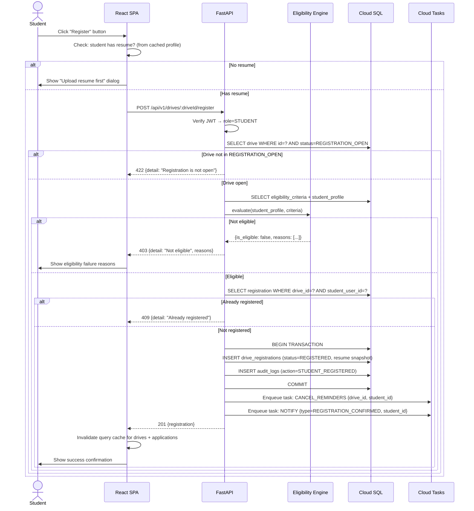
```mermaid
sequenceDiagram
    actor S as Student
    participant FE as React SPA
    participant BE as FastAPI
    participant EE as Eligibility Engine
    participant DB as Cloud SQL
    participant CT as Cloud Tasks

    S->>FE: Click "Register" button
    FE->>FE: Check: student has resume? (from cached profile)
    alt No resume
        FE->>S: Show "Upload resume first" dialog
    else Has resume
        FE->>BE: POST /api/v1/drives/:driveId/register
        BE->>BE: Verify JWT → role=STUDENT
        BE->>DB: SELECT drive WHERE id=? AND status=REGISTRATION_OPEN
        alt Drive not in REGISTRATION_OPEN
            BE-->>FE: 422 {detail: "Registration is not open"}
        else Drive open
            BE->>DB: SELECT eligibility_criteria + student_profile
            BE->>EE: evaluate(student_profile, criteria)
            alt Not eligible
                EE-->>BE: {is_eligible: false, reasons: [...]}
                BE-->>FE: 403 {detail: "Not eligible", reasons}
                FE->>S: Show eligibility failure reasons
            else Eligible
                BE->>DB: SELECT registration WHERE drive_id=? AND student_user_id=?
                alt Already registered
                    BE-->>FE: 409 {detail: "Already registered"}
                else Not registered
                    BE->>DB: BEGIN TRANSACTION
                    BE->>DB: INSERT drive_registrations (status=REGISTERED, resume snapshot)
                    BE->>DB: INSERT audit_logs (action=STUDENT_REGISTERED)
                    BE->>DB: COMMIT
                    BE->>CT: Enqueue task: CANCEL_REMINDERS {drive_id, student_id}
                    BE->>CT: Enqueue task: NOTIFY {type=REGISTRATION_CONFIRMED, student_id}
                    BE-->>FE: 201 {registration}
                    FE->>FE: Invalidate query cache for drives + applications
                    FE->>S: Show success confirmation
                end
            end
        end
    end
```

---

### Flow 6: Placement Stage Update

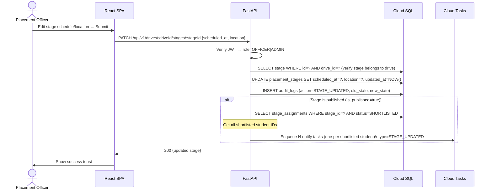
```mermaid
sequenceDiagram
    actor O as Placement Officer
    participant FE as React SPA
    participant BE as FastAPI
    participant DB as Cloud SQL
    participant CT as Cloud Tasks

    O->>FE: Edit stage schedule/location → Submit
    FE->>BE: PATCH /api/v1/drives/:driveId/stages/:stageId {scheduled_at, location}
    BE->>BE: Verify JWT → role=OFFICER|ADMIN
    BE->>DB: SELECT stage WHERE id=? AND drive_id=? (verify stage belongs to drive)
    BE->>DB: UPDATE placement_stages SET scheduled_at=?, location=?, updated_at=NOW()
    BE->>DB: INSERT audit_logs (action=STAGE_UPDATED, old_state, new_state)

    alt Stage is published (is_published=true)
        BE->>DB: SELECT stage_assignments WHERE stage_id=? AND status=SHORTLISTED
        note over BE: Get all shortlisted student IDs
        BE->>CT: Enqueue N notify tasks (one per shortlisted student)\ntype=STAGE_UPDATED
    end

    BE-->>FE: 200 {updated stage}
    FE->>O: Show success toast
```

---

### Flow 7: New Placement Notification (Drive Published)

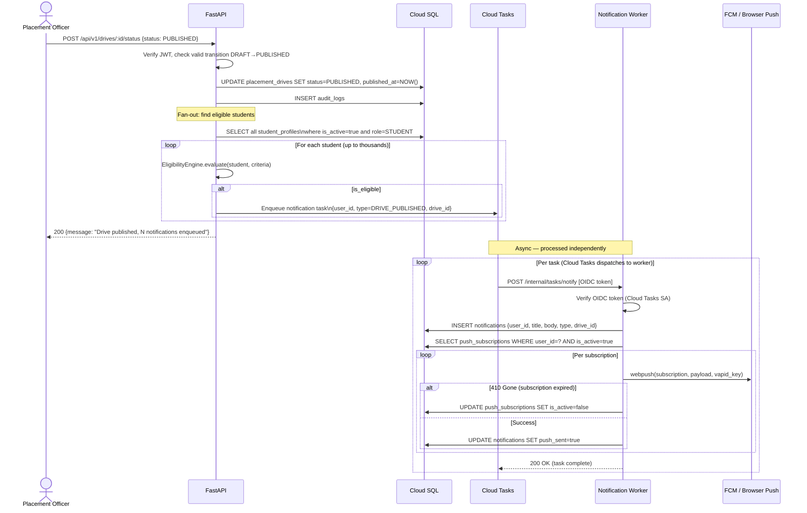
```mermaid
sequenceDiagram
    actor O as Placement Officer
    participant BE as FastAPI
    participant DB as Cloud SQL
    participant CT as Cloud Tasks
    participant WKR as Notification Worker
    participant PUSH as FCM / Browser Push

    O->>BE: POST /api/v1/drives/:id/status {status: PUBLISHED}
    BE->>BE: Verify JWT, check valid transition DRAFT→PUBLISHED
    BE->>DB: UPDATE placement_drives SET status=PUBLISHED, published_at=NOW()
    BE->>DB: INSERT audit_logs

    Note over BE: Fan-out: find eligible students
    BE->>DB: SELECT all student_profiles\nwhere is_active=true and role=STUDENT
    loop For each student (up to thousands)
        BE->>BE: EligibilityEngine.evaluate(student, criteria)
        alt is_eligible
            BE->>CT: Enqueue notification task\n{user_id, type=DRIVE_PUBLISHED, drive_id}
        end
    end

    BE-->>O: 200 {message: "Drive published, N notifications enqueued"}

    Note over CT,WKR: Async — processed independently

    loop Per task (Cloud Tasks dispatches to worker)
        CT->>WKR: POST /internal/tasks/notify [OIDC token]
        WKR->>WKR: Verify OIDC token (Cloud Tasks SA)
        WKR->>DB: INSERT notifications {user_id, title, body, type, drive_id}
        WKR->>DB: SELECT push_subscriptions WHERE user_id=? AND is_active=true
        loop Per subscription
            WKR->>PUSH: webpush(subscription, payload, vapid_key)
            alt 410 Gone (subscription expired)
                WKR->>DB: UPDATE push_subscriptions SET is_active=false
            else Success
                WKR->>DB: UPDATE notifications SET push_sent=true
            end
        end
        WKR-->>CT: 200 OK (task complete)
    end
```

---

### Flow 8: Deadline Reminder

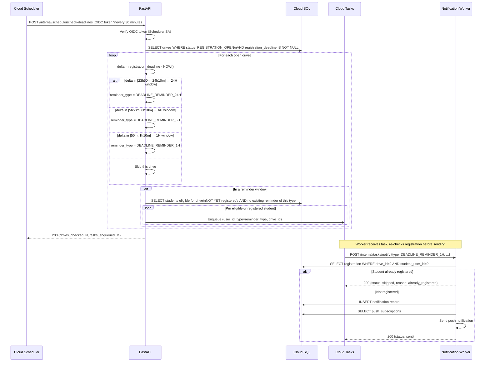
```mermaid
sequenceDiagram
    participant CS as Cloud Scheduler
    participant BE as FastAPI
    participant DB as Cloud SQL
    participant CT as Cloud Tasks
    participant WKR as Notification Worker

    CS->>BE: POST /internal/scheduler/check-deadlines [OIDC token]\nevery 30 minutes
    BE->>BE: Verify OIDC token (Scheduler SA)

    BE->>DB: SELECT drives WHERE status=REGISTRATION_OPEN\nAND registration_deadline IS NOT NULL
    loop For each open drive
        BE->>BE: delta = registration_deadline - NOW()
        alt delta in [23h50m, 24h10m] → 24H window
            BE->>BE: reminder_type = DEADLINE_REMINDER_24H
        else delta in [5h50m, 6h10m] → 6H window
            BE->>BE: reminder_type = DEADLINE_REMINDER_6H
        else delta in [50m, 1h10m] → 1H window
            BE->>BE: reminder_type = DEADLINE_REMINDER_1H
        else
            BE->>BE: Skip this drive
        end

        alt In a reminder window
            BE->>DB: SELECT students eligible for drive\nNOT YET registered\nAND no existing reminder of this type
            loop Per eligible-unregistered student
                BE->>CT: Enqueue {user_id, type=reminder_type, drive_id}
            end
        end
    end

    BE-->>CS: 200 {drives_checked: N, tasks_enqueued: M}

    Note over CT,WKR: Worker receives task, re-checks registration before sending
    CT->>WKR: POST /internal/tasks/notify {type=DEADLINE_REMINDER_1H, ...}
    WKR->>DB: SELECT registration WHERE drive_id=? AND student_user_id=?
    alt Student already registered
        WKR-->>CT: 200 {status: skipped, reason: already_registered}
    else Not registered
        WKR->>DB: INSERT notification record
        WKR->>DB: SELECT push_subscriptions
        WKR->>WKR: Send push notification
        WKR-->>CT: 200 {status: sent}
    end
```

---

### Flow 9: Resume Upload

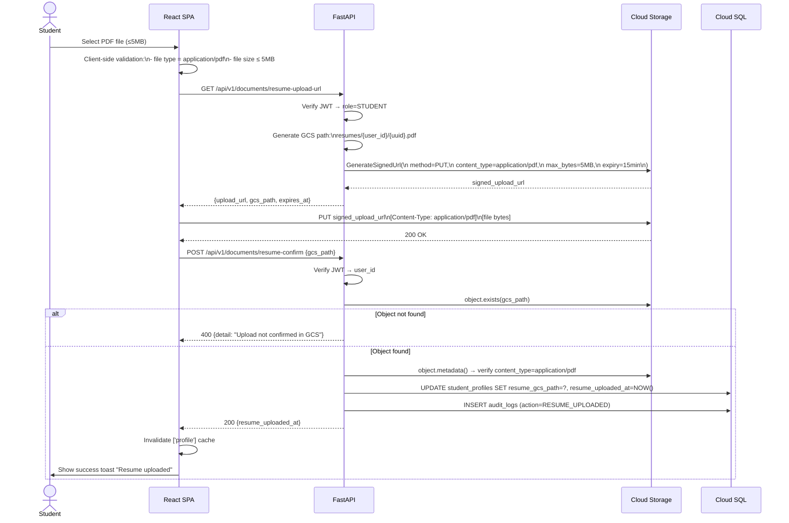
```mermaid
sequenceDiagram
    actor S as Student
    participant FE as React SPA
    participant BE as FastAPI
    participant GCS as Cloud Storage
    participant DB as Cloud SQL

    S->>FE: Select PDF file (≤5MB)
    FE->>FE: Client-side validation:\n- file type = application/pdf\n- file size ≤ 5MB
    FE->>BE: GET /api/v1/documents/resume-upload-url
    BE->>BE: Verify JWT → role=STUDENT
    BE->>BE: Generate GCS path:\nresumes/{user_id}/{uuid}.pdf
    BE->>GCS: GenerateSignedUrl(\n  method=PUT,\n  content_type=application/pdf,\n  max_bytes=5MB,\n  expiry=15min\n)
    GCS-->>BE: signed_upload_url
    BE-->>FE: {upload_url, gcs_path, expires_at}

    FE->>GCS: PUT signed_upload_url\n[Content-Type: application/pdf]\n[file bytes]
    GCS-->>FE: 200 OK

    FE->>BE: POST /api/v1/documents/resume-confirm {gcs_path}
    BE->>BE: Verify JWT → user_id
    BE->>GCS: object.exists(gcs_path)
    alt Object not found
        BE-->>FE: 400 {detail: "Upload not confirmed in GCS"}
    else Object found
        BE->>GCS: object.metadata() → verify content_type=application/pdf
        BE->>DB: UPDATE student_profiles SET resume_gcs_path=?, resume_uploaded_at=NOW()
        BE->>DB: INSERT audit_logs (action=RESUME_UPLOADED)
        BE-->>FE: 200 {resume_uploaded_at}
        FE->>FE: Invalidate ['profile'] cache
        FE->>S: Show success toast "Resume uploaded"
    end
```

---

### Flow 10: Student Viewing Their Own Application Data

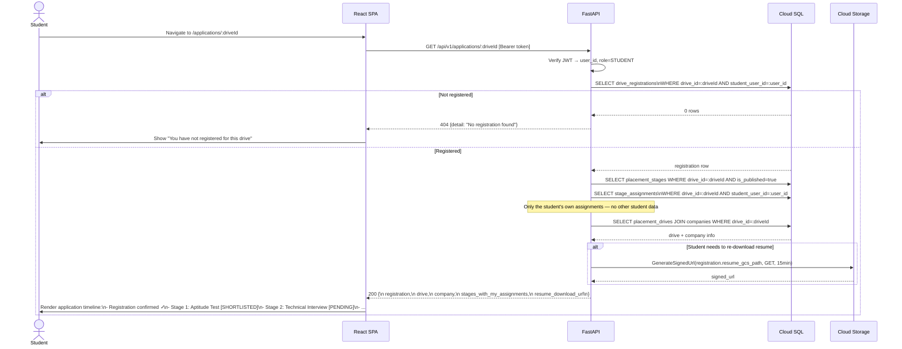
```mermaid
sequenceDiagram
    actor S as Student
    participant FE as React SPA
    participant BE as FastAPI
    participant DB as Cloud SQL
    participant GCS as Cloud Storage

    S->>FE: Navigate to /applications/:driveId
    FE->>BE: GET /api/v1/applications/:driveId [Bearer token]
    BE->>BE: Verify JWT → user_id, role=STUDENT
    BE->>DB: SELECT drive_registrations\nWHERE drive_id=:driveId AND student_user_id=:user_id
    alt Not registered
        DB-->>BE: 0 rows
        BE-->>FE: 404 {detail: "No registration found"}
        FE->>S: Show "You have not registered for this drive"
    else Registered
        DB-->>BE: registration row
        BE->>DB: SELECT placement_stages WHERE drive_id=:driveId AND is_published=true
        BE->>DB: SELECT stage_assignments\nWHERE drive_id=:driveId AND student_user_id=:user_id
        note over BE: Only the student's own assignments — no other student data

        BE->>DB: SELECT placement_drives JOIN companies WHERE drive_id=:driveId
        DB-->>BE: drive + company info

        alt Student needs to re-download resume
            BE->>GCS: GenerateSignedUrl(registration.resume_gcs_path, GET, 15min)
            GCS-->>BE: signed_url
        end

        BE-->>FE: 200 {\n  registration,\n  drive,\n  company,\n  stages_with_my_assignments,\n  resume_download_url\n}
        FE->>S: Render application timeline:\n- Registration confirmed ✓\n- Stage 1: Aptitude Test [SHORTLISTED]\n- Stage 2: Technical Interview [PENDING]\n- ...
    end
```

---

## 10. Technology Selection Rationale

| Technology | Decision | Reason |
|---|---|---|
| **React + TypeScript** | ✅ Chosen | Industry standard, strong typing reduces bugs, large ecosystem |
| **FastAPI** | ✅ Chosen | Auto OpenAPI docs, native async, Pydantic validation, Python ecosystem |
| **PostgreSQL** | ✅ Chosen | JSONB for eligibility, ACID transactions, excellent Cloud SQL managed service |
| **Cloud Run** | ✅ Chosen | Serverless containers, pay-per-use, no cluster management, auto-scale |
| **Cloud Tasks** | ✅ Chosen | Replaces need for RabbitMQ/Kafka for async notification fan-out at this scale |
| **Cloud Scheduler** | ✅ Chosen | Managed cron, replaces need for Celery Beat |
| **Cloud Storage** | ✅ Chosen | Private buckets, signed URLs, managed — no S3/MinIO needed |
| **Secret Manager** | ✅ Chosen | Secure secrets, no .env files in prod, rotatable |
| **Redis** | ❌ Rejected | Cloud Tasks + PostgreSQL covers all async needs at this scale |
| **Kafka / Pub/Sub** | ❌ Rejected | Overkill for a single-college system; Cloud Tasks sufficient |
| **Kubernetes** | ❌ Rejected | Cloud Run provides managed container hosting without k8s overhead |
| **Microservices** | ❌ Rejected | Single college use case; modular monolith is simpler and sufficient |
| **Celery** | ❌ Rejected | Cloud Tasks is managed and eliminates need for a Celery broker (Redis/RabbitMQ) |
| **Firebase Auth** | ❌ Rejected | Custom JWT gives us full control over token claims, rotation, and revocation |

---

## 11. Student Placement Preparation & Readiness Architecture

### 11.1 Currently Implemented: Phase 5.1 (Placement Preparation Hub)
- **Role Taxonomy (`preparation_roles`)**: Standard career profiles (Software Developer, AI/ML Engineer, Data Analyst, Cloud & DevOps, QA / Test Automation, GenAI Engineer).
- **Categories & Topics (`preparation_categories`, `preparation_topics`, `preparation_role_topics`)**: Knowledge taxonomy across Aptitude, Verbal Ability, Technical Core, and Interview Preparation.
- **Resource Library (`preparation_materials`)**: Curated study materials (Articles, Docs, Videos, Practice Questions) mapped to topics and target roles.
- **Community Sourcing & Officer Review Workflow**: Students suggest resources (`status=PENDING`); Placement Officers and Admins review, approve, or reject submissions with full audit logging.

### 11.2 Future Planned Roadmap (NOT Yet Implemented)
- **Phase 5.2 (Planned Future Capability)**: Placement Assessment Engine (timed practice tests, question banks, section scoring, deterministic weakness mapping).
- **Phase 5.3 (Planned Future Capability)**: AI Mock Interview (role-specific mock interview room, server-side LLM provider abstraction with local mock service, actionable feedback).
- **Phase 5.4 (Planned Future Capability)**: Personalized Placement Readiness (Placement Readiness Score gauge, priority study recommendations on dashboard).

