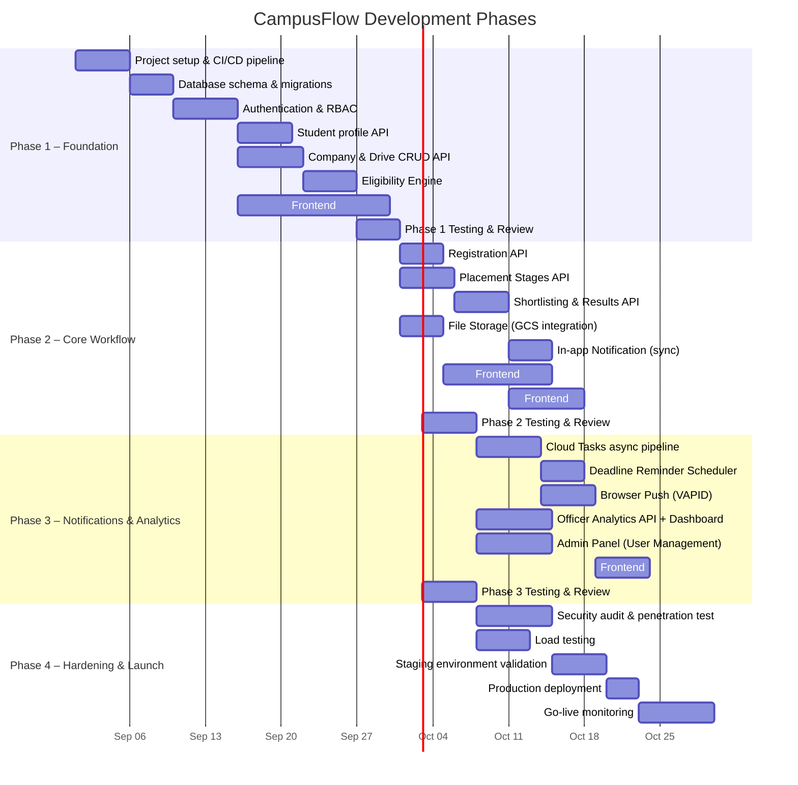

# CampusFlow — Development Plan

## 1. Development Philosophy

- **Iterative delivery:** Each phase delivers working, testable functionality.
- **API-first:** Backend endpoints are built and tested before frontend integration.
- **Test as you go:** Unit tests accompany each feature; integration tests per phase.
- **No real student data:** All development and testing uses synthetic data only.
- **Separate environments:** Dev (Docker Compose local) → Staging (GCP staging project) → Production.

---

## 2. Development Timeline



---

## 3. Phase 1 — Foundation

**Goal:** Working authentication, student profiles, company/drive management, and eligibility engine. No registration, no notifications.

**Duration:** ~6 weeks

### 3.1 Infrastructure Setup (Week 1)

**Tasks:**
- [ ] Initialize Git monorepo structure: `backend/`, `frontend/`, `infra/`, `docs/`
- [ ] Set up Docker Compose for local dev (PostgreSQL 15, backend, frontend)
- [ ] Configure CI/CD pipeline (GitHub Actions):
  - Backend: lint (ruff), type check (mypy), unit tests (pytest)
  - Frontend: lint (ESLint), type check (tsc), unit tests (Vitest)
  - Build Docker images on PR merge
- [ ] Set up Alembic for database migrations
- [ ] Configure pre-commit hooks (detect-secrets, ruff, prettier)
- [ ] Create synthetic data generation script (Faker library)

### 3.2 Database — Phase 1 Tables

Tables to create:
- `users`
- `refresh_tokens`
- `student_profiles`
- `student_profile_history`
- `companies`
- `placement_drives`
- `eligibility_criteria`
- `audit_logs`
- `system_config`

### 3.3 Backend — Phase 1 API

**Auth module:**
- `POST /auth/login`
- `POST /auth/refresh`
- `POST /auth/logout`
- `POST /auth/change-password`

**Student profile module:**
- `GET /students/me`
- `PATCH /students/me`
- `GET /officers/students` (paginated, filtered)
- `GET /officers/students/{student_id}`

**Company module:**
- `POST /companies`
- `GET /companies`
- `GET /companies/{id}`
- `PATCH /companies/{id}`

**Drive module:**
- `POST /drives`
- `GET /drives`
- `GET /drives/{id}` (with eligibility check for student)
- `PATCH /drives/{id}`
- `POST /drives/{id}/status` (DRAFT → PUBLISHED only for Phase 1)
- `GET /drives/{id}/eligible-students`
- `GET /drives/{id}/eligibility-check` (for student)

**Eligibility Engine:**
- Pure Python service class with evaluators
- Unit tests covering all criteria combinations
- Edge cases: null criteria fields, empty lists, boundary CGPA values

### 3.4 Frontend — Phase 1 Pages

- **Login page** (email/password form)
- **Student dashboard** — placement feed (drive cards)
- **Drive detail page** — drive info + eligibility status breakdown
- **Student profile page** — view and edit profile
- **Officer: Drive list** — list drives, create drive form
- **Officer: Drive detail** — edit drive, manage eligibility criteria, view eligible students

### 3.5 Phase 1 Testing

| Test Type | Scope | Tool |
|---|---|---|
| Unit | Eligibility engine (all evaluators) | pytest |
| Unit | JWT generation/validation | pytest |
| Unit | Drive status machine | pytest |
| Integration | Auth flow (login → access → refresh → logout) | pytest + httpx |
| Integration | Drive create → publish → eligibility check | pytest + httpx |
| E2E | Student views drive + sees eligibility | Playwright |

---

## 4. Phase 2 — Core Workflow

**Goal:** Students can register for drives. Placement officers can manage stages and shortlist students. Results can be published.

**Duration:** ~5 weeks

### 4.1 Database — Phase 2 Tables

- `drive_registrations`
- `placement_stages`
- `stage_assignments`
- `notifications` (structure only, no async delivery yet)

### 4.2 Backend — Phase 2 API

**File Storage:**
- `GET /students/me/resume-upload-url` (signed GCS URL)
- `POST /students/me/resume-confirm`
- `GET /students/me/resume-download-url`
- `GET /officers/students/{id}/resume-download-url`

**Registration:**
- `POST /drives/{id}/register`
- `GET /drives/{id}/registrations`
- `GET /students/me/applications`

**Stages:**
- `POST /drives/{id}/stages`
- `GET /drives/{id}/stages`
- `PATCH /drives/{id}/stages/{stage_id}`
- `POST /drives/{id}/stages/{stage_id}/publish`
- `POST /drives/{id}/stages/{stage_id}/shortlist`
- `PATCH /drives/{id}/stages/{stage_id}/assignments/{student_id}`
- `POST /drives/{id}/stages/{stage_id}/publish-results`

**Notifications (sync, in-app only):**
- `GET /notifications`
- `POST /notifications/{id}/read`
- `POST /notifications/read-all`

### 4.3 Frontend — Phase 2 Pages

- **Resume upload UI** (within student profile)
- **Registration button** on drive detail page (with eligibility gate)
- **My Applications page** — list + status per drive
- **Application detail page** — stage timeline for one drive
- **Officer: Registration list** per drive (with resume download links)
- **Officer: Stage management** — create/edit stages, shortlist UI, result entry
- **Notification bell** (unread count badge, dropdown list)

### 4.4 Phase 2 Testing

| Test Type | Scope | Tool |
|---|---|---|
| Unit | Registration validation (eligibility gate, duplicate check) | pytest |
| Unit | Stage assignment state machine | pytest |
| Integration | Full registration flow | pytest + httpx |
| Integration | Shortlisting → stage assignment → result publish | pytest + httpx |
| Integration | GCS signed URL generation (mock GCS) | pytest |
| E2E | Student: register for drive, view application status | Playwright |
| E2E | Officer: shortlist students, publish results | Playwright |

---

## 5. Phase 3 — Notifications & Analytics

**Goal:** Async notification pipeline live. Deadline reminders working. Browser push working. Analytics dashboard.

**Duration:** ~5 weeks

### 5.1 Backend — Phase 3

**Async notification pipeline:**
- `POST /internal/tasks/send-notification` (Cloud Tasks handler)
- `POST /internal/scheduler/check-deadlines` (Cloud Scheduler handler)
- Cloud Tasks queue provisioning (via Terraform or gcloud CLI)
- Cloud Scheduler job configuration

**Browser Push:**
- `POST /notifications/push-subscription`
- `DELETE /notifications/push-subscription`
- Service Worker implementation (frontend)
- VAPID key management

**Manual Notifications:**
- `POST /drives/{id}/notify`

**Analytics:**
- `GET /admin/analytics/overview`
- `GET /drives/{id}/analytics`

**Admin:**
- `GET /admin/users`
- `POST /admin/users`
- `PATCH /admin/users/{id}`
- `POST /admin/students/bulk-import`
- `GET /admin/audit-logs`

### 5.2 Frontend — Phase 3 Pages

- **Notification permission prompt** (push opt-in)
- **Notification center page** (full list, read/unread filter)
- **Officer: Analytics dashboard** (charts: funnel, branch breakdown)
- **Admin: User management** (list, create, deactivate)
- **Admin: Audit log viewer** (filterable table)

### 5.3 Phase 3 Testing

| Test Type | Scope | Tool |
|---|---|---|
| Unit | Deadline reminder window calculation | pytest |
| Unit | Duplicate reminder prevention logic | pytest |
| Unit | Push subscription management | pytest |
| Integration | Drive published → tasks enqueued (mock Cloud Tasks) | pytest |
| Integration | Deadline scheduler → correct students selected | pytest |
| Integration | Registration → reminder tasks cancelled | pytest |
| Load | Notification fan-out: 5000 students | Locust |
| E2E | Browser push received in test browser | Playwright |

---

## 6. Phase 4 — Hardening & Launch

**Goal:** System is production-ready, secure, and validated under realistic load.

**Duration:** ~4 weeks

### 6.1 Security Hardening

- [ ] External security audit or self-conducted penetration test
- [ ] OWASP Top 10 checklist review against live staging
- [ ] Verify all endpoints enforce server-side authorization
- [ ] Test resume URL access (verify student A cannot access student B's resume)
- [ ] Rate limiting validation
- [ ] Secret Manager integration verified in staging
- [ ] Cloud Armor rules tuned

### 6.2 Load Testing

**Tool:** Locust (Python-based load testing)

**Scenarios:**
| Scenario | Target | Expected RPS |
|---|---|---|
| Students browsing drive feed | 1000 concurrent | 500 RPS |
| Bulk registration during open window | 500 concurrent | 200 RPS |
| Notification fan-out (10k students) | Background | Cloud Tasks only |
| Officer viewing full registration list | 50 concurrent | 50 RPS |

**Acceptance criteria:** 95th percentile < 500ms under load.

### 6.3 Deployment Pipeline

```
Developer pushes feature branch
        │
        ▼
GitHub Actions CI:
├── Lint + type check
├── Unit tests (pytest + Vitest)
├── Build Docker image
└── Push to Artifact Registry
        │
        ▼
Merge to main → Auto-deploy to Staging (Cloud Run)
        │
        ▼
Manual approval gate
        │
        ▼
Deploy to Production (Cloud Run)
        │
        ▼
Smoke tests on production
        │
        ▼
Monitor: Cloud Monitoring + Error Reporting (7 days)
```

### 6.4 Production Checklist

- [ ] Cloud SQL: private IP only, daily backups enabled, PITR enabled
- [ ] Cloud Run: min instances = 1 (no cold start on first request)
- [ ] Cloud Armor: WAF rules active
- [ ] Secret Manager: all secrets rotated from development values
- [ ] Cloud Logging: structured logging enabled, error alerting configured
- [ ] GCS bucket: uniform access control, versioning enabled, no public ACLs
- [ ] HTTPS: HTTP → HTTPS redirect enforced
- [ ] Domain: Custom domain configured with managed TLS certificate

---

## 7. Repository Structure

```
campusflow/
├── backend/
│   ├── app/
│   │   ├── api/v1/
│   │   ├── core/
│   │   ├── eligibility/
│   │   ├── notifications/
│   │   ├── models/
│   │   ├── schemas/
│   │   ├── repositories/
│   │   └── services/
│   ├── alembic/
│   ├── tests/
│   │   ├── unit/
│   │   └── integration/
│   ├── Dockerfile
│   ├── pyproject.toml
│   └── requirements.txt
│
├── frontend/
│   ├── src/
│   │   ├── components/
│   │   ├── pages/
│   │   ├── hooks/
│   │   ├── services/
│   │   ├── store/
│   │   └── types/
│   ├── public/
│   │   └── sw.js (Service Worker)
│   ├── Dockerfile
│   ├── package.json
│   └── vite.config.ts
│
├── infra/
│   ├── terraform/          (GCP infrastructure as code)
│   └── cloudbuild/         (CI/CD pipeline configs)
│
├── docs/
│   ├── REQUIREMENTS.md
│   ├── ARCHITECTURE.md
│   ├── DATABASE_SCHEMA.md
│   ├── API_SPEC.md
│   ├── SECURITY.md
│   ├── NOTIFICATION_ARCHITECTURE.md
│   └── DEVELOPMENT_PLAN.md
│
├── scripts/
│   └── seed_data.py        (Synthetic test data generator)
│
├── docker-compose.yml      (Local development)
└── .github/
    └── workflows/
        ├── backend-ci.yml
        └── frontend-ci.yml
```

---

## 8. Definition of Done (Per Feature)

A feature is considered **done** when:

1. ✅ Backend endpoint(s) implemented with Pydantic validation
2. ✅ Server-side authorization enforced (role + resource ownership)
3. ✅ Unit tests covering happy path + primary error cases
4. ✅ Integration test covering the end-to-end flow
5. ✅ Audit log entry created where applicable
6. ✅ OpenAPI schema auto-generated and accurate
7. ✅ Frontend component implemented and connected to API
8. ✅ No real student data used in any test
9. ✅ Code reviewed and merged via PR

---

## 9. Tech Stack Summary

| Layer | Technology | Rationale |
|---|---|---|
| Frontend | React 18 + TypeScript + Vite | Modern, type-safe, fast builds |
| State | React Query + Zustand | Server state + client state separated |
| Routing | React Router v6 | Standard SPA routing |
| Backend | FastAPI + Python 3.11 | Async, auto OpenAPI, Python ecosystem |
| ORM | SQLAlchemy 2.0 (async) | Modern async ORM, Alembic migrations |
| Auth | python-jose + passlib | JWT + bcrypt |
| Validation | Pydantic v2 | Strict input validation |
| Database | PostgreSQL 15 | Cloud SQL managed, reliable, JSONB support |
| File Storage | Google Cloud Storage | Private buckets, signed URLs |
| Task Queue | Google Cloud Tasks | Durable async, OIDC auth, retry support |
| Scheduler | Google Cloud Scheduler | Managed cron, OIDC to Cloud Tasks |
| Secrets | Google Secret Manager | No secrets in code |
| Compute | Google Cloud Run | Stateless, auto-scale, containerized |
| CI/CD | GitHub Actions | Familiar, integrates with GCP |
| Testing (BE) | pytest + httpx + Locust | Unit, integration, load |
| Testing (FE) | Vitest + Playwright | Unit + E2E |
| IaC | Terraform | Reproducible GCP infra |
