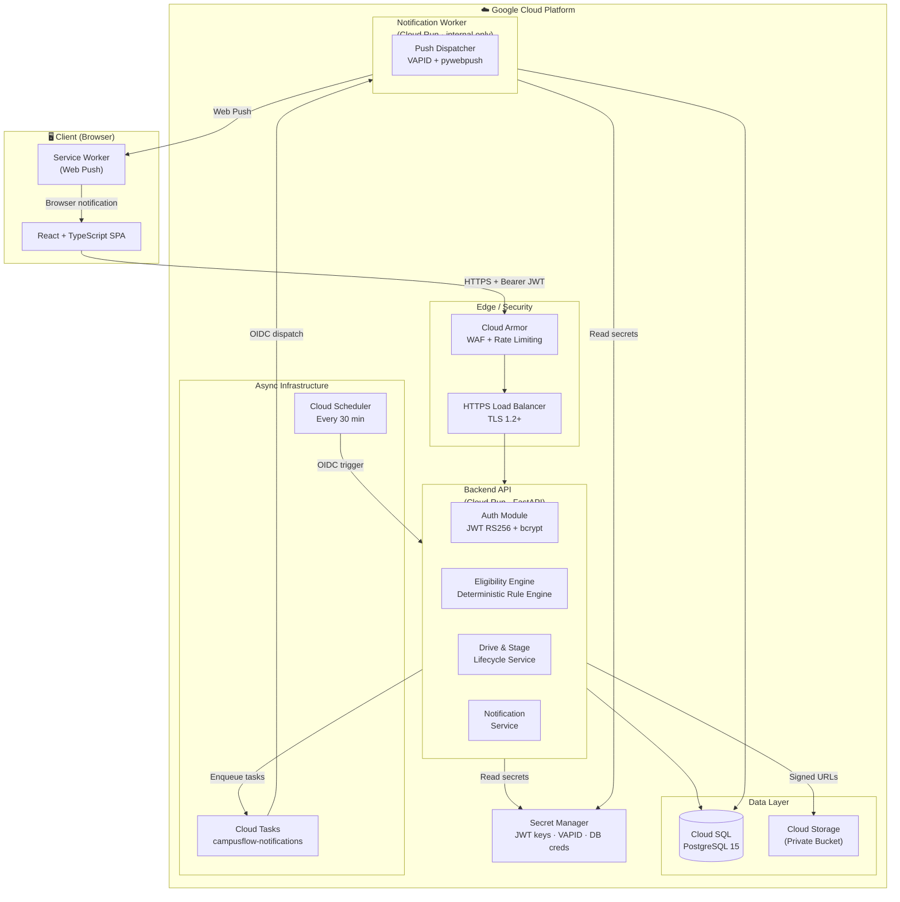
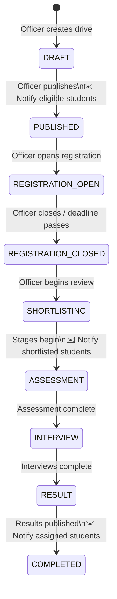
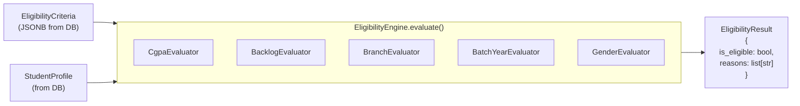
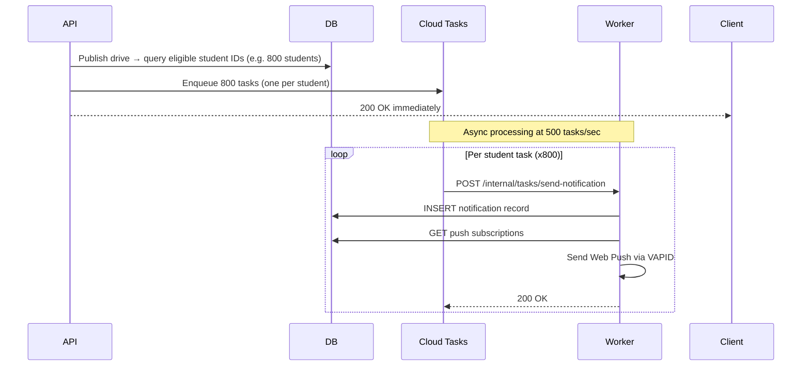

# CampusFlow — Implementation Plan

## Executive Summary

CampusFlow is a college placement management platform designed to replace the WhatsApp + Google Forms workflow with a centralized, structured system. This document summarizes the engineering blueprint across 7 planning documents and identifies key architectural risks and decisions that require team review before implementation begins.

---

## Blueprint Documents Created

| Document | Purpose | Link |
|---|---|---|
| REQUIREMENTS.md | User roles, functional requirements, NFRs | [REQUIREMENTS.md](file:///C:/Users/pylas/.gemini/antigravity-ide/brain/e9f55231-808b-4a33-961a-7930d7f8fddb/REQUIREMENTS.md) |
| ARCHITECTURE.md | System topology, Mermaid diagrams, component breakdown | [ARCHITECTURE.md](file:///C:/Users/pylas/.gemini/antigravity-ide/brain/e9f55231-808b-4a33-961a-7930d7f8fddb/ARCHITECTURE.md) |
| DATABASE_SCHEMA.md | 14 PostgreSQL tables, ERD, JSONB eligibility design | [DATABASE_SCHEMA.md](file:///C:/Users/pylas/.gemini/antigravity-ide/brain/e9f55231-808b-4a33-961a-7930d7f8fddb/DATABASE_SCHEMA.md) |
| API_SPEC.md | All REST endpoints with request/response schemas | [API_SPEC.md](file:///C:/Users/pylas/.gemini/antigravity-ide/brain/e9f55231-808b-4a33-961a-7930d7f8fddb/API_SPEC.md) |
| SECURITY.md | Auth, RBAC, GCS signed URLs, OWASP mitigations | [SECURITY.md](file:///C:/Users/pylas/.gemini/antigravity-ide/brain/e9f55231-808b-4a33-961a-7930d7f8fddb/SECURITY.md) |
| NOTIFICATION_ARCHITECTURE.md | Async Cloud Tasks pipeline, deadline reminders, VAPID push | [NOTIFICATION_ARCHITECTURE.md](file:///C:/Users/pylas/.gemini/antigravity-ide/brain/e9f55231-808b-4a33-961a-7930d7f8fddb/NOTIFICATION_ARCHITECTURE.md) |
| DEVELOPMENT_PLAN.md | 4 phases, Gantt chart, tech stack, Definition of Done | [DEVELOPMENT_PLAN.md](file:///C:/Users/pylas/.gemini/antigravity-ide/brain/e9f55231-808b-4a33-961a-7930d7f8fddb/DEVELOPMENT_PLAN.md) |

---

## Proposed Architecture at a Glance

---

## Placement Lifecycle State Machine

---

## Eligibility Engine Design

> **Key design decision:** Criteria are stored as JSONB. New evaluators can be added without modifying existing drive records. The engine skips criteria fields that are absent or null — full backward compatibility is guaranteed.

---

## Notification Fan-out Pipeline

---

## Critical Architectural Risks

> [!CAUTION]
> **RISK 1 — Eligibility Engine vs. Profile Updates**
> A student who updates their CGPA after a drive is published may become newly eligible or lose eligibility. The system must decide:
> - Option A: Eligibility is evaluated **at registration time** (live, always fresh).
> - Option B: Eligibility is pre-cached and re-computed on profile update.
>
> **Current design:** Option A (live evaluation at every GET /drives/:id and at registration). This is correct but may generate additional DB load at scale.

> [!CAUTION]
> **RISK 2 — Reminder Task Deduplication Race Condition**
> Cloud Scheduler fires every 30 minutes. If two jobs overlap (e.g., due to Cloud Scheduler at-least-once delivery), duplicate reminder tasks could be enqueued and result in duplicate notifications.
>
> **Current mitigation:** Pre-enqueue check in `notifications` table + worker-side idempotency guard. A distributed lock (Redis or Spanner) may be needed for stricter guarantees at scale.

> [!CAUTION]
> **RISK 3 — Cloud Tasks vs. Pub/Sub for Fan-out**
> Cloud Tasks tasks are created individually (one API call per task). For drives with 5,000+ eligible students, this means 5,000 individual API calls to Cloud Tasks during drive publication.
>
> **Current design:** Acceptable for Phase 1 (most college drives target < 1,000 students). If institutional scale grows beyond 10,000 students, consider switching fan-out triggering to **Cloud Pub/Sub** with a single publish event and a subscriber that performs batched DB reads.

> [!WARNING]
> **RISK 4 — JWT Key Rotation**
> RS256 JWT signing uses asymmetric keys stored in Secret Manager. Key rotation (recommended every 90 days) will invalidate all active access tokens.
>
> **Mitigation:** Implement JWKS endpoint (`GET /.well-known/jwks.json`) with support for multiple active key IDs (`kid`). This allows zero-downtime key rotation.

> [!WARNING]
> **RISK 5 — GCS Signed URL Expiry vs. Large File Downloads**
> Signed URLs for resume download are set to expire in 15 minutes. If a user has a slow connection or their browser caches the link, the download may fail.
>
> **Mitigation:** Frontend should always fetch a fresh signed URL immediately before initiating download, never cache it.

> [!NOTE]
> **RISK 6 — Browser Push Permission**
> Browser push requires explicit user permission. Expect a significant portion of students to deny push permissions (typical denial rate: 30–50%). The in-app notification system (polling) serves as the reliable fallback. This is acceptable by design.

---

## Open Questions Requiring Decisions Before Phase 1 Begins

| # | Question | Impact | Options |
|---|---|---|---|
| 1 | **Student account creation:** How are students initially added to the system? Admin bulk CSV import, self-registration with email domain restriction, or SSO with college identity provider? | Auth design, onboarding UX | CSV import (simplest for Phase 1) |
| 2 | **CGPA / backlog updates:** Who can update a student's academic data? Only the student, or also placement officers/admin for bulk corrections? | Profile & audit design | Both, with admin override + audit log |
| 3 | **Multiple placements:** Can a student register for multiple drives? Is there a "one placement" policy? | Registration logic, state tracking | Platform enforces no limit by default; placement policy configured per-institution |
| 4 | **Drive lifecycle rollback:** Can a drive go back from REGISTRATION_OPEN to PUBLISHED (e.g., to fix criteria)? | Drive state machine | Current design: no rollback. Drives can only advance. |
| 5 | **Notification preferences:** Should students be able to opt out of specific notification types? | Notification schema, UX | Phase 2 feature; Phase 1 sends all notifications to all eligible students |
| 6 | **Cloud infrastructure billing:** Single GCP project or separate projects per environment? | Cost management, security isolation | Recommended: separate projects (dev/staging/prod) |
| 7 | **Custom domain:** What domain will be used for production? | TLS cert provisioning, CORS config | Needs confirmation before staging setup |

---

## Phased Delivery Summary

| Phase | Deliverable | Duration |
|---|---|---|
| **Phase 1** | Auth + Profiles + Companies + Drives + Eligibility Engine | ~6 weeks |
| **Phase 2** | Registration + Resume Upload + Stages + Shortlisting + Results + In-app Notifications | ~5 weeks |
| **Phase 3** | Async Cloud Tasks Pipeline + Deadline Reminders + Browser Push + Analytics + Admin Panel | ~5 weeks |
| **Phase 4** | Security Audit + Load Testing + Staging Validation + Production Launch | ~4 weeks |

**Total estimated timeline: ~20 weeks from Phase 1 kickoff to production launch.**

---

## Recommended Starting Point

When approved, begin with:

1. **Repository structure** — monorepo with `backend/`, `frontend/`, `docs/`, `infra/`
2. **Docker Compose** for local dev (PostgreSQL 15 + FastAPI backend + Vite frontend)
3. **Alembic baseline migration** — Phase 1 tables (9 tables)
4. **Synthetic data seed script** — 200 fake students, 5 companies, 10 drives
5. **Auth endpoints** — login, refresh, logout (the foundation everything else depends on)
6. **Eligibility Engine** — pure Python, fully unit-tested before any API integration

> [!IMPORTANT]
> No production GCP resources should be provisioned until Phase 1 backend is stable and passing all integration tests in the local Docker Compose environment. Use Cloud Run only from Phase 2 onwards.
