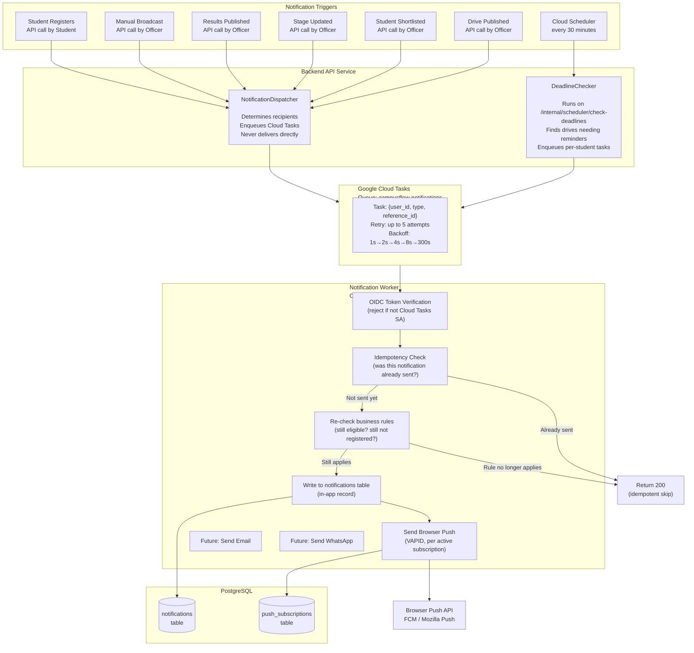
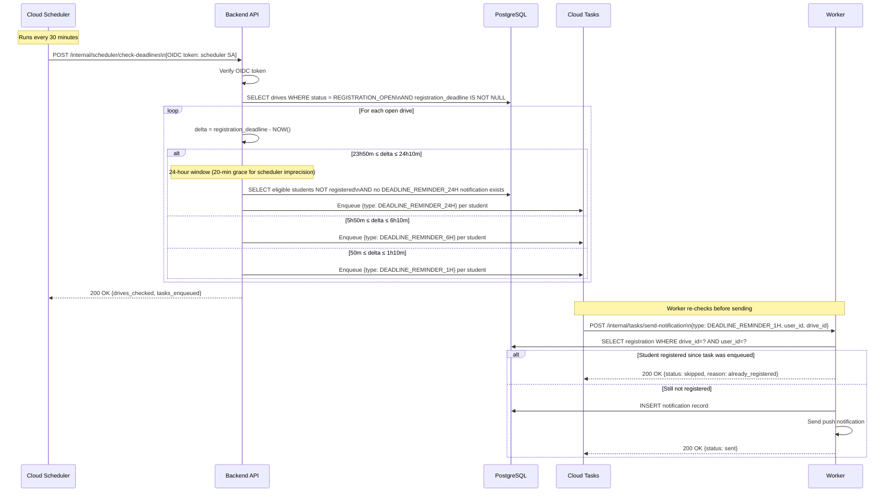
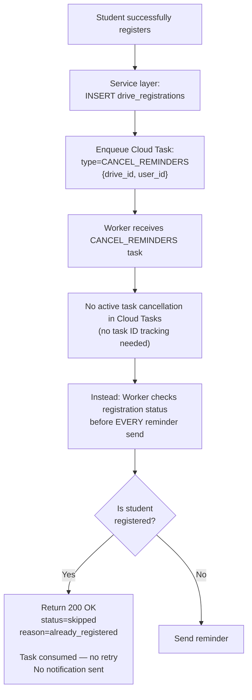
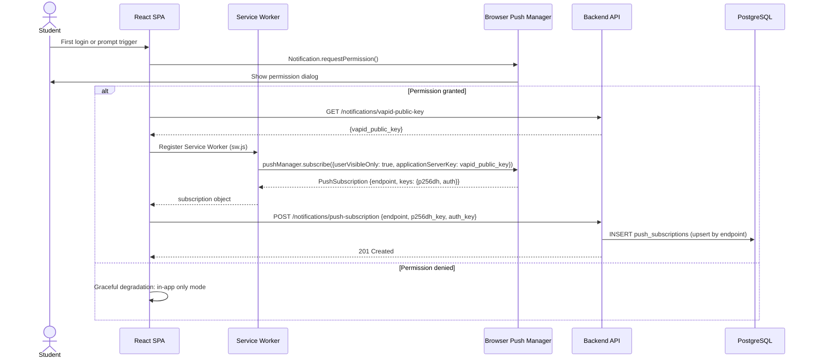
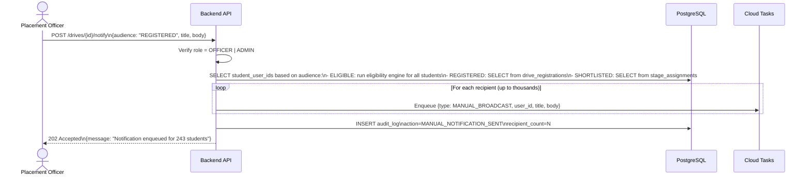

# CampusFlow — Notification Architecture

> **Version:** 2.0 | **Date:** 2026-08-27  
> Notifications are a core product feature, not an afterthought. The primary product problem is students missing placement opportunities. The notification system is how CampusFlow solves that.

---

## 1. Core Constraint

> **A single HTTP request must NEVER synchronously send notifications to thousands of students.**

Violating this constraint means:
- API responses time out under load
- A single push failure crashes the entire request
- Retries are impossible without re-running the whole operation
- The placement officer sees a slow or failed response

**All notification fan-out is asynchronous** via Cloud Tasks. The API enqueues tasks and returns immediately.

---

## 2. Notification Channels (Phase 1)

| Channel | Mechanism | Delivery Time | User Opt-in Required | Phase |
|---|---|---|---|---|
| **In-App** | DB record + client polling | ~30 seconds | No (always on) | 1 |
| **Browser Push** | Web Push Protocol (VAPID) | Near real-time | Yes | 1 |
| **Email** | SendGrid or similar | Minutes | Yes | 2 |
| **WhatsApp** | WhatsApp Business API | Near real-time | Yes | 3 |

**Design principle:** The notification system is **channel-agnostic** at the data model level. A notification record in the database is channel-neutral. The worker decides how to deliver it based on the user's active subscriptions. Adding a new channel (email, WhatsApp) means adding a new delivery strategy in the worker — no schema changes.

---

## 3. Notification Event Catalog

| Event Type | DB Constant | Trigger | Audience | Priority |
|---|---|---|---|---|
| New drive published | `DRIVE_PUBLISHED` | Officer: `DRAFT → PUBLISHED` | Eligible students | High |
| Deadline approaching 24h | `DEADLINE_REMINDER_24H` | Scheduler | Eligible + not registered | Medium |
| Deadline approaching 6h | `DEADLINE_REMINDER_6H` | Scheduler | Eligible + not registered | High |
| Deadline approaching 1h | `DEADLINE_REMINDER_1H` | Scheduler | Eligible + not registered | Critical |
| Registration confirmed | `REGISTRATION_CONFIRMED` | Student registers | That student only | Low |
| Shortlisted for stage | `SHORTLISTED` | Officer shortlists | Shortlisted students | High |
| Stage schedule updated | `STAGE_UPDATED` | Officer updates published stage | Shortlisted students | High |
| Results published | `RESULT_PUBLISHED` | Officer: publish-results | Assigned students | High |
| Manual broadcast | `MANUAL_BROADCAST` | Officer: /drives/:id/notify | Configurable audience | Medium |

---

## 4. Full Notification Pipeline Architecture



---

## 5. Asynchronous Fan-out Design

### 5.1 Why One Task Per Student

**Alternative considered:** One task per drive → worker fetches all eligible students → sends all pushes

**Problem with batch approach:**
- If worker crashes midway, there is no way to know which students were notified
- Retry would re-notify already-notified students
- No per-student retry granularity

**Chosen approach:** One Cloud Task per student notification
- Each task is independently retryable
- Failure of one student's notification doesn't affect others
- Idempotency check in the worker prevents double-sends on retry

### 5.2 Fan-out at Scale

For a drive with 2,000 eligible students, the API enqueues 2,000 Cloud Tasks.

Cloud Tasks dispatches at `500 tasks/sec max`. All 2,000 tasks will be dispatched within ~4 seconds to the worker pool. With 20 worker instances running in parallel, all notifications will be delivered within 1-2 minutes of the drive being published.

```
Drive published → 2,000 tasks enqueued in ~400ms (Cloud Tasks write is fast)
API returns to officer: 200 OK in < 500ms total

Cloud Tasks dispatches:
500 tasks/sec → 2,000 students notified in ~4 seconds of task processing
```

---

## 6. Cloud Tasks Configuration

### 6.1 Queue Settings

```yaml
Queue: campusflow-notifications
Location: asia-south1

Rate limits:
  maxDispatchesPerSecond: 500
  maxConcurrentDispatches: 100

Retry config:
  maxAttempts: 5
  minBackoff: 1s
  maxBackoff: 300s
  maxDoublings: 4          # 1s → 2s → 4s → 8s → 300s
  maxRetryDuration: 3600s  # Give up after 1 hour

Routing:
  target: campusflow-worker Cloud Run
  httpMethod: POST
  path: /internal/tasks/send-notification
  oidcToken:
    serviceAccountEmail: campusflow-tasks-sa@project.iam.gserviceaccount.com
```

### 6.2 Task Payload Schema

```json
{
  "notification_id": null,
  "user_id": "uuid",
  "notification_type": "DRIVE_PUBLISHED",
  "title": "New Placement Drive: Acme Corp",
  "body": "Acme Corp is hiring for SDE Intern 2025. Check your eligibility.",
  "reference_id": "drive-uuid",
  "reference_type": "DRIVE",
  "send_push": true,
  "idempotency_key": "DRIVE_PUBLISHED:drive-uuid:user-uuid"
}
```

**`idempotency_key`:** A stable string combining notification type + reference ID + user ID. Used by the worker to detect and skip duplicate tasks.

---

## 7. Deadline Reminder System

### 7.1 Architecture



### 7.2 Reminder Deduplication Strategy

**Problem:** Cloud Scheduler fires every 30 minutes. A drive with deadline at T+5h will be in the 6H window for 20 minutes (two scheduler runs). Without deduplication, the student gets two 6H reminders.

**Solution — Two-layer deduplication:**

**Layer 1: Pre-enqueue check (SQL)**
```sql
-- Only enqueue if no notification of this type exists for this user+drive:
SELECT id FROM notifications
WHERE user_id = :user_id
  AND notification_type = :reminder_type     -- e.g., 'DEADLINE_REMINDER_6H'
  AND reference_id = :drive_id
  AND reference_type = 'DRIVE'
LIMIT 1;
-- If row found: skip enqueue
```

**Layer 2: Worker-side idempotency (defense in depth)**
```python
# Worker checks idempotency_key before writing notification:
existing = await repo.get_notification_by_idempotency_key(task.idempotency_key)
if existing:
    return {"status": "skipped", "reason": "idempotent_duplicate"}
```

**Layer 3: Registration re-check (cancellation)**
```python
# Worker re-checks registration even if task was enqueued when student was unregistered:
registration = await repo.get_registration(user_id=task.user_id, drive_id=task.reference_id)
if registration and registration.status == "REGISTERED":
    return {"status": "skipped", "reason": "already_registered"}
```

### 7.3 Registration → Reminder Stop Mechanism



**Why not cancel Cloud Tasks tasks?** Cloud Tasks doesn't provide an efficient way to cancel tasks by business criteria. The simpler, more reliable approach is: always re-check at delivery time. If the student is registered, the worker silently skips. This is more robust than task cancellation and handles race conditions naturally.

---

## 8. In-App Notification System

### 8.1 Storage & Persistence

Every notification is written to the `notifications` table **before** any push attempt. This guarantees:
- The student always has an in-app notification history
- If push delivery fails, the student can still see the notification in-app
- Push delivery status (`push_sent`, `push_sent_at`) is tracked separately from notification existence

### 8.2 Client Retrieval (Phase 1: Polling)

```
React component mounts (or user opens notification bell)
        │
        ▼
TanStack Query: GET /api/v1/notifications?is_read=false&page_size=20
        │ (refetch interval: 30 seconds while tab is active)
        ▼
Backend returns: {items, unread_count}
        │
        ▼
Zustand: update unread_count (drives badge on bell icon)
        │
        ▼
Render notification dropdown
```

**Phase 2 upgrade path:** Replace polling with Server-Sent Events (SSE) or WebSocket for real-time delivery. FastAPI supports both natively. The switch requires no schema changes.

### 8.3 Unread Count Management

```
unread_count = SELECT COUNT(*) FROM notifications WHERE user_id = ? AND is_read = FALSE

Updates on:
├── POST /notifications/{id}/read → decrement by 1
├── POST /notifications/mark-all-read → set to 0
└── Background push received → increment by 1 (via Service Worker → broadcast to React)
```

---

## 9. Browser Push Notification Architecture

### 9.1 VAPID Key Management

```
VAPID Private Key → stored in Google Secret Manager (campusflow/vapid-private-key)
VAPID Public Key  → stored in Google Secret Manager + served via GET /notifications/vapid-public-key

Key generation: openssl ecparam -genkey -name prime256v1 -noout | openssl pkcs8 -topk8 -nocrypt
```

### 9.2 Push Subscription Flow



### 9.3 Push Delivery & Error Handling

```python
# Worker: push delivery with full error handling
async def send_push_notification(subscription: PushSubscription, payload: dict):
    try:
        webpush(
            subscription_info={
                "endpoint": subscription.endpoint,
                "keys": {
                    "p256dh": subscription.p256dh_key,
                    "auth": subscription.auth_key
                }
            },
            data=json.dumps({
                "title": payload["title"],
                "body": payload["body"],
                "icon": "/icon-192.png",
                "badge": "/badge-72.png",
                "data": {
                    "url": f"/drives/{payload['reference_id']}",
                    "notification_id": payload["notification_id"]
                }
            }),
            vapid_private_key=settings.VAPID_PRIVATE_KEY,
            vapid_claims={"sub": "mailto:admin@campusflow.college"}
        )
        await repo.mark_push_sent(subscription.id, notification_id)

    except WebPushException as e:
        if e.response.status_code == 410:
            # Subscription expired — browser unsubscribed or cleared
            await repo.deactivate_subscription(subscription.id)
            # Do NOT retry — 410 is permanent
        elif e.response.status_code == 429:
            # Rate limited by push service — Cloud Tasks will retry
            raise  # Let Cloud Tasks retry with backoff
        else:
            logger.error(f"Push failed: {e}")
            raise  # Let Cloud Tasks retry
```

### 9.4 Service Worker Behavior

```javascript
// sw.js — Service Worker
self.addEventListener('push', event => {
  const data = event.data.json();
  event.waitUntil(
    self.registration.showNotification(data.title, {
      body: data.body,
      icon: '/icon-192.png',
      badge: '/badge-72.png',
      data: data.data,
      requireInteraction: data.data.priority === 'CRITICAL'
    })
  );
});

self.addEventListener('notificationclick', event => {
  event.notification.close();
  event.waitUntil(
    clients.openWindow(event.notification.data.url)
    // Deep links to the relevant drive/stage page
  );
});
```

---

## 10. Manual Broadcast Flow

When a placement officer sends a manual notification:



**Audience options:**
- `ELIGIBLE` — all students who pass the eligibility engine for this drive
- `REGISTERED` — all students who have registered for this drive
- `SHORTLISTED` — all students shortlisted in the most recent active stage

---

## 11. Future Channel Extension

The worker architecture is designed to add channels with no schema changes:

```
Worker receives task
        │
        ▼
Write in-app notification record (always)
        │
        ├── if user has push_subscriptions → send Web Push
        ├── if user.email_notifications_enabled → (Phase 2) send Email via SendGrid
        └── if user.whatsapp_number AND whatsapp_enabled → (Phase 3) send via WA Business API
```

Adding email in Phase 2 requires:
1. Add `email_notifications_enabled` column to `users` (or a separate `notification_preferences` table)
2. Add email-sending code to the worker
3. No notification schema changes
4. No task queue changes
5. No API changes
