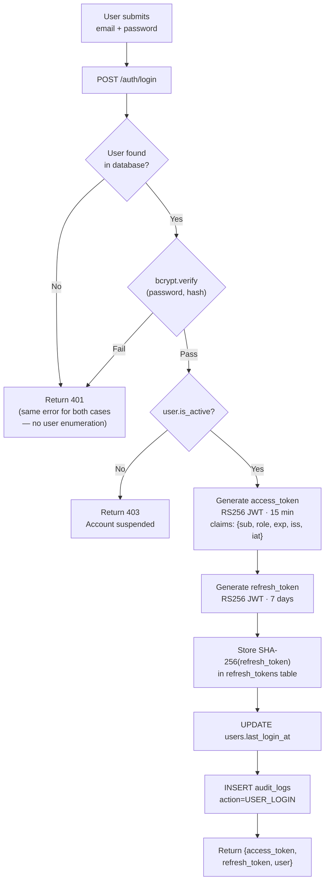
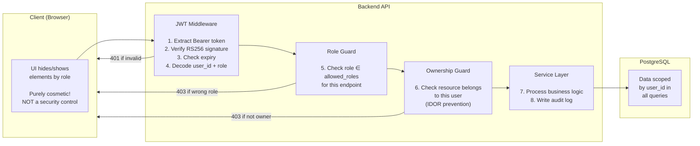
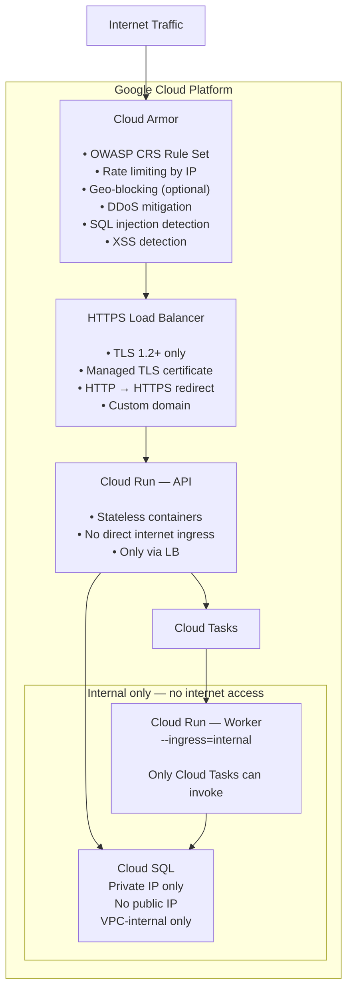

# CampusFlow — Security Architecture

> **Version:** 2.2 | **Updated:** 2026-08-27 (all pre-Phase-1 decisions finalized)  
> Student data is sensitive. Security is a first-class architectural concern, not an afterthought.

---

## 1. Security Principles

| Principle | Application to CampusFlow |
|---|---|
| **Defense in Depth** | Multiple independent security layers — one failure does not compromise the system |
| **Never Trust the Frontend** | Every backend endpoint independently verifies auth and authorization — UI restrictions are cosmetic only |
| **Least Privilege** | Every service account, role, and user gets only the minimum permissions required |
| **Zero Public Exposure** | Student documents are never publicly accessible under any circumstance |
| **Audit Everything** | All state-changing operations produce immutable, tamper-proof audit log entries |
| **No Secrets in Code** | All credentials, keys, and secrets live in Google Secret Manager — never in source code, .env files, or container images |

---

## 2. Authentication Architecture

### 2.1 Auth Flow Overview



### 2.2 Token Design

| Token | Algorithm | Lifetime | Storage (Client) | Stored Server-Side? |
|---|---|---|---|---|
| Access Token | RS256 JWT | 15 minutes | JavaScript memory only | ❌ No (stateless) |
| Refresh Token | RS256 JWT | 7 days | sessionStorage or memory | ✅ SHA-256 hash only |

**Why RS256 (asymmetric)?**
- Private key is stored only in Secret Manager — never accessible by any client
- Public key exposed via JWKS endpoint (see §2.4) — enables key rotation without downtime
- Compromised public key cannot forge tokens

**JWT `kid` (Key ID) claim — required from Day 1:**
```json
{
  "kid": "campusflow-key-v1",
  "sub": "user-uuid",
  "role": "STUDENT",
  "email": "student@college.edu",
  "iss": "https://campusflow.internal",
  "iat": 1722700000,
  "exp": 1722700900
}
```
The `kid` claim identifies which public key to use for verification. All tokens carry this claim from the first deployment so that key rotation never requires invalidating existing sessions.

### 2.4 JWKS Key Rotation (Day 1 Requirement)

Key rotation must work without invalidating in-flight sessions:

```
Normal operation:
  Secret Manager: { "campusflow-key-v1": <private_key_v1> }
  JWKS endpoint:  { keys: [{ kid: "campusflow-key-v1", ... public_key_v1 ... }] }
  All tokens:     kid = "campusflow-key-v1"

Rotation procedure (zero downtime):
  Step 1: Generate new key pair → store as "campusflow-key-v2" in Secret Manager
  Step 2: Update JWKS endpoint to publish BOTH keys:
          { keys: [{ kid: "campusflow-key-v1" }, { kid: "campusflow-key-v2" }] }
  Step 3: Deploy: new tokens use kid=v2; old tokens with kid=v1 still verify
  Step 4: Wait 15 minutes (all v1 access tokens expire — lifetime is 15 min)
  Step 5: Remove v1 from JWKS; remove v1 private key from Secret Manager
```

**JWKS endpoint:** `GET /.well-known/jwks.json` (public, no auth required)

```json
{
  "keys": [
    {
      "kty": "RSA",
      "kid": "campusflow-key-v1",
      "use": "sig",
      "alg": "RS256",
      "n": "<modulus>",
      "e": "AQAB"
    }
  ]
}
```

**Verification logic:** The JWT middleware reads `kid` from the token header, looks up the corresponding public key in the JWKS cache (refreshed every 5 minutes), and verifies the signature. No Secret Manager call per request.

**Why not store access tokens in localStorage?**
- localStorage is accessible to any JavaScript on the page (XSS risk)
- Access tokens are kept in memory (Zustand store) — cleared on tab close
- If XSS occurs, the 15-minute window limits blast radius

### 2.3 Session Lifecycle

| Event | Action |
|---|---|
| Login | New access + refresh token issued; refresh hash stored in DB |
| API request | Access token verified stateless (no DB lookup) |
| Access token expiry | Axios interceptor calls `/auth/refresh` automatically |
| Logout | Refresh token hash set `revoked = TRUE` in DB |
| Password change | ALL refresh tokens for user set `revoked = TRUE` |
| Account deactivated | ALL refresh tokens revoked; subsequent API calls fail at JWT decode phase |
| Refresh token expired | Return 401; client redirects to login |

---

## 3. Authorization Model

### 3.1 Role-Based Access Control (RBAC)

Three roles, enforced at the API service layer:

```
STUDENT   → Self-service: profile, view drives, register, track applications
OFFICER   → Drive management: companies, drives, stages, shortlisting, results, notifications
ADMIN     → Governance: users, roles, audit logs, system config, all officer capabilities
```

### 3.2 Authorization Boundary Diagram



### 3.3 Permission Matrix

| Resource | Action | STUDENT | OFFICER | ADMIN |
|---|---|---|---|---|
| Own profile | Read + Update | ✅ | — | ✅ |
| Other student profile | Read | ❌ | ✅ | ✅ |
| Own resume | Upload + Download | ✅ | — | — |
| Any student resume | Download | ❌ | ✅ (audit logged) | ✅ (audit logged) |
| CGPA / backlogs | View | ✅ (read-only) | ✅ | ✅ |
| CGPA / backlogs | Update | ❌ **Never** | ✅ (audit logged) | ✅ (audit logged) |
| Companies | Read | ✅ | ✅ | ✅ |
| Companies | Create / Update | ❌ | ✅ | ✅ |
| Drives (DRAFT) | View | ❌ | ✅ | ✅ |
| Drives (PUBLISHED+) | View | ✅ | ✅ | ✅ |
| Drives | Create / Manage | ❌ | ✅ | ✅ |
| Drive status transition | Trigger | ❌ | ✅ | ✅ |
| Eligibility check (own) | Run | ✅ | — | — |
| Registration | Create own | ✅ | — | — |
| Registrations | View all for drive | ❌ | ✅ | ✅ |
| Stages | Create / Manage | ❌ | ✅ | ✅ |
| Stages | View (if shortlisted) | ✅ | ✅ | ✅ |
| Shortlist students | Create | ❌ | ✅ | ✅ |
| Notifications | View own | ✅ | ✅ | ✅ |
| Notifications | Send bulk | ❌ | ✅ | ✅ |
| Users | Manage all | ❌ | ❌ | ✅ |
| Audit logs | View | ❌ | ❌ | ✅ |
| System config | Manage | ❌ | ❌ | ✅ |

### 3.4 IDOR Prevention

**IDOR (Insecure Direct Object Reference)** is the risk of Student A accessing Student B's data by guessing or modifying resource IDs.

**Defenses:**

1. **UUID primary keys** — 122-bit random UUIDs are not guessable (unlike sequential integers)
2. **Ownership checks in service layer** — every resource access verifies the authenticated user owns or is authorized to access the resource
3. **Never trust ID from request body for ownership** — ownership is always determined from the verified JWT claim

**Examples:**
```
Student tries: GET /api/v1/documents/students/{other_student_id}/resume-url
Backend:
  1. JWT → current_user.role = STUDENT
  2. Role check: STUDENT not in [OFFICER, ADMIN] → 403 Forbidden

Student tries: GET /api/v1/notifications/{other_student_notification_id}/read
Backend:
  1. JWT → current_user.id = student_A_id
  2. Fetch notification: notification.user_id = student_B_id
  3. current_user.id != notification.user_id → 403 Forbidden
```

---

## 4. Secure Document Storage

### 4.1 GCS Bucket Architecture

```
Bucket: campusflow-prod-private                  Bucket: campusflow-prod-public
├── Access: PRIVATE                              ├── Access: PUBLIC READ
├── Uniform bucket-level access: ON             ├── Used for: company logos
├── Public ACLs: BLOCKED                        └── CDN: Cloud CDN enabled
├── Versioning: ENABLED
├── Contents:
│   ├── resumes/{user_id}/{uuid}.pdf
│   └── avatars/{user_id}/{uuid}.jpg
└── Access: Via backend signed URLs ONLY
    Never via direct GCS URL
```

### 4.2 Resume Upload Flow (Security Detail)

```mermaid
sequenceDiagram
    participant S as Student
    participant BE as Backend API
    participant GCS as Cloud Storage

    S->>BE: GET /documents/resume-upload-url [Bearer token]
    BE->>BE: Verify JWT — extract user_id
    BE->>BE: Generate GCS path:\nresumes/{user_id}/{uuid}.pdf
    note over BE: UUID prevents path traversal\nuser_id scopes to student's folder
    BE->>GCS: SignedUrl(method=PUT, path, conditions=[
        content-type=application/pdf,
        content-length-range=[1, 5242880],
        expiry=900s
    ])
    GCS-->>BE: signed_url
    BE-->>S: {upload_url, gcs_path, expires_at}

    S->>GCS: PUT {signed_url}\n[Content-Type: application/pdf]\n[Body: file bytes]
    GCS->>GCS: Enforce: content-type must be PDF\nEnforce: size ≤ 5MB\nEnforce: URL not expired
    GCS-->>S: 200 OK

    S->>BE: POST /documents/resume-confirm {gcs_path}
    BE->>BE: Verify gcs_path starts with resumes/{current_user.id}/
    note over BE: Prevents student A confirming\nstudent B's path
    BE->>GCS: blob.exists(gcs_path)
    BE->>GCS: blob.content_type == application/pdf
    BE->>DB: UPDATE student_profiles SET resume_gcs_path, resume_uploaded_at
    BE->>DB: INSERT audit_logs
    BE-->>S: 200 OK
```

### 4.3 Signed URL Properties

| Property | Value | Reason |
|---|---|---|
| Expiry | 15 minutes | Short window minimizes risk if URL is leaked |
| Method | GET (download) or PUT (upload only) | Cannot be reused for different operations |
| Content-Type constraint | `application/pdf` | GCS rejects non-PDF uploads at the URL level |
| Size constraint | ≤ 5MB | Set in `content-length-range` condition on signed URL |
| Path structure | `{type}/{user_id}/{uuid}.{ext}` | UUID prevents filename collisions; user_id scopes access |
| Signed by | Backend service account (not user) | Client never has credentials to GCS |

---

## 5. Network Security

### 5.1 Security Layers



### 5.2 TLS Policy
- Minimum TLS 1.2 enforced at Load Balancer
- TLS 1.3 preferred
- HTTP → HTTPS redirect enforced (301)
- HSTS header: `Strict-Transport-Security: max-age=31536000; includeSubDomains`

### 5.3 Cloud Run Security
- **API service:** Accessible via Load Balancer only — no direct URL access
- **Worker service:** `--ingress=internal` — completely unreachable from internet
- **No service-to-service HTTP** — worker is called only by Cloud Tasks with OIDC token

---

## 6. Input Validation

### 6.1 Validation Layers

| Layer | Tool | Purpose |
|---|---|---|
| Frontend | Zod (React Hook Form) | UX validation — does NOT replace backend |
| API boundary | Pydantic v2 strict mode | Type coercion disabled; unknown fields rejected |
| Service layer | Business rule validation | Drive status checks, eligibility, deadline checks |
| Database | PostgreSQL CHECK constraints | Last line of defense for data integrity |

### 6.2 Pydantic Strict Mode

All request schemas use `model_config = ConfigDict(strict=True, extra='forbid')`:
- `strict=True` → no type coercion (string `"7"` is not accepted for a float field)
- `extra='forbid'` → unknown fields in request body cause immediate 422 rejection
- Strings are trimmed and length-limited
- Email fields normalized to lowercase

### 6.3 File Validation

| Validation | Enforcement Point |
|---|---|
| File type = PDF | GCS signed URL conditions (enforced by GCS itself) |
| File size ≤ 5MB | GCS signed URL `content-length-range` condition |
| Filename safety | Never used — backend generates UUID-based GCS paths |
| GCS path ownership | Backend verifies path starts with `{type}/{current_user.id}/` before confirming |

---

## 7. OWASP Top 10 Mitigation Map

| OWASP Risk | Mitigation in CampusFlow |
|---|---|
| **A01 Broken Access Control** | Server-side RBAC + ownership check on every endpoint; UUID keys; no sequential IDs |
| **A02 Cryptographic Failures** | bcrypt (cost 12) for passwords; RS256 JWTs; HTTPS only; GCS private bucket; secrets in Secret Manager |
| **A03 Injection** | SQLAlchemy ORM with parameterized queries; Pydantic strict mode; no raw SQL |
| **A04 Insecure Design** | Security designed from architecture phase; threat-modeled per domain |
| **A05 Security Misconfiguration** | IaC-managed GCP config; Cloud Armor enabled; no public IPs; `--ingress=internal` for worker |
| **A06 Vulnerable Components** | Dependency scanning in CI (Dependabot/Snyk); pinned versions in `requirements.txt` |
| **A07 Identification and Authentication Failures** | Short-lived JWTs; revocable refresh tokens; rate-limited login; no user enumeration |
| **A08 Software and Data Integrity Failures** | GCS signed URL content-type/size enforcement; resume confirm step verifies upload |
| **A09 Security Logging and Monitoring Failures** | Immutable audit_logs table; Cloud Logging integration; error alerting |
| **A10 SSRF** | No user-controlled URL fetching; GCS URLs generated only by backend with hardcoded bucket/path prefixes |

---

## 8. Audit Logging

### 8.1 Mandatory Audit Events

| Category | Events |
|---|---|
| Authentication | `USER_LOGIN`, `USER_LOGIN_FAILED`, `USER_LOGOUT`, `PASSWORD_CHANGED`, `TOKEN_REVOKED`, `ACCOUNT_ACTIVATED`, `ACTIVATION_RESENT` |
| User Management | `USER_CREATED`, `USER_DEACTIVATED`, `USER_ROLE_CHANGED` |
| Academic Data | `CGPA_UPDATED`, `BACKLOGS_UPDATED` (with old/new values; `changed_by` must be OFFICER or ADMIN) |
| Drive Lifecycle | `DRIVE_CREATED`, `DRIVE_STATUS_CHANGED` (old→new status; officer\_id recorded) |
| Eligibility | `ELIGIBILITY_CRITERIA_UPDATED` |
| Registration | `STUDENT_REGISTERED`, `REGISTRATION_CANCELLED` |
| Shortlisting | `STUDENT_SHORTLISTED`, `STAGE_RESULT_UPDATED` |
| Documents | `RESUME_UPLOADED`, `RESUME_DOWNLOADED` (with officer_id + student_id) |
| Notifications | `MANUAL_NOTIFICATION_SENT` |
| Admin | `CONFIG_CHANGED`, `BULK_IMPORT_STARTED`, `BULK_IMPORT_COMPLETED`, `BRANCH_CREATED`, `BRANCH_DEACTIVATED` |

### 8.2 Audit Log Integrity

```sql
-- PostgreSQL trigger: prevent modification of audit_logs
CREATE OR REPLACE FUNCTION audit_logs_immutable()
RETURNS TRIGGER AS $$
BEGIN
  RAISE EXCEPTION 'audit_logs table is immutable — updates and deletes are not permitted';
END;
$$ LANGUAGE plpgsql;

CREATE TRIGGER audit_logs_no_update
  BEFORE UPDATE OR DELETE ON audit_logs
  FOR EACH ROW EXECUTE FUNCTION audit_logs_immutable();
```

### 8.3 Who Populates the Audit Log

- `performed_by_user_id` is **always** populated from the verified JWT claim — never from the request body
- For Cloud Tasks/Scheduler-triggered actions: `performed_by_user_id = NULL`, action set to `SYSTEM_*` prefix
- IP address is extracted from `X-Forwarded-For` header (set by Cloud Load Balancer — cannot be spoofed by client)

---

## 9. Secrets Management

### 9.1 Secret Inventory

| Secret Name (Secret Manager) | Contents | Rotation |
|---|---|---|
| `campusflow/jwt-private-key` | RS256 private key (PEM) — labelled with `kid` version | 90 days |
| `campusflow/jwt-public-key` | RS256 public key (PEM) — labelled with `kid` version | 90 days |
| `campusflow/db-password` | PostgreSQL password | 180 days |
| `campusflow/vapid-private-key` | Web Push VAPID private key | Annual |
| `campusflow/vapid-public-key` | Web Push VAPID public key | Annual |
| `campusflow/sendgrid-api-key` | SendGrid API key for transactional email (Decision A) | 180 days |

### 9.2 Secret Access Pattern

```python
# At application startup (not per-request):
from google.cloud import secretmanager

client = secretmanager.SecretManagerServiceClient()
secret = client.access_secret_version(name="projects/.../secrets/campusflow/jwt-private-key/versions/latest")
JWT_PRIVATE_KEY = secret.payload.data.decode("utf-8")

# Cached in Settings singleton for the lifetime of the Cloud Run instance
# Never written to disk
# Never logged
```

### 9.3 Key Rotation Strategy

JWT key rotation without downtime requires supporting two active key IDs:
1. Add new key version to Secret Manager
2. Update service to load both keys: `ACTIVE_KEY = new_key`, `VERIFICATION_KEYS = [new_key, old_key]`
3. Deploy — new tokens use new key; existing tokens with old key still verify
4. After 15 minutes (all old tokens expired), remove old key from verification set

---

## 10. Development Security Requirements

| Requirement | Enforcement |
|---|---|
| No real student data in dev/staging | Enforced by policy; seed script generates synthetic data only |
| Separate GCP projects | dev / staging / production are separate GCP projects — no shared credentials |
| Pre-commit hooks | `detect-secrets` prevents accidental credential commits |
| Branch protection | No direct pushes to `main` — all changes via reviewed PR |
| Dependency scanning | Dependabot or Snyk runs on every PR |
| Container image scanning | Artifact Registry vulnerability scanning enabled |
| `.env.example` not `.env` | `.env` files are `.gitignored`; only `.env.example` with placeholder values committed |
